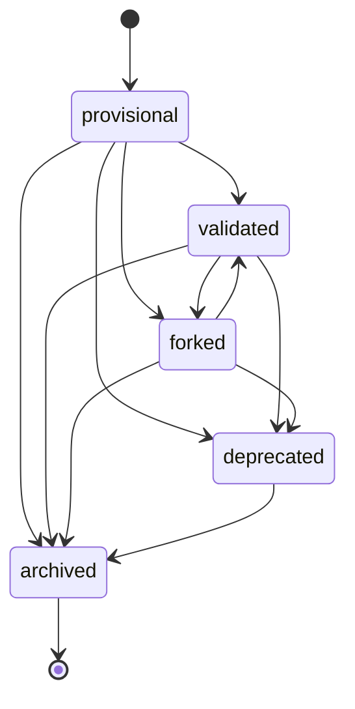
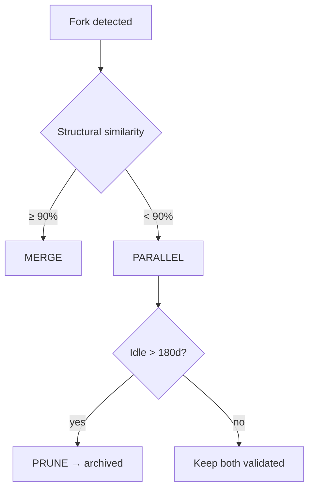
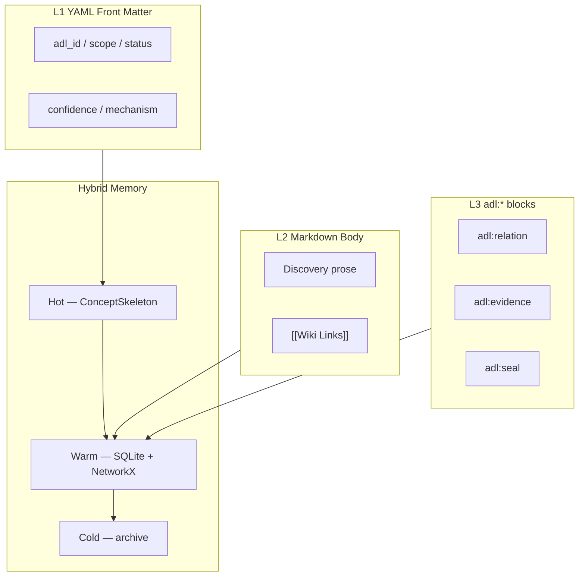
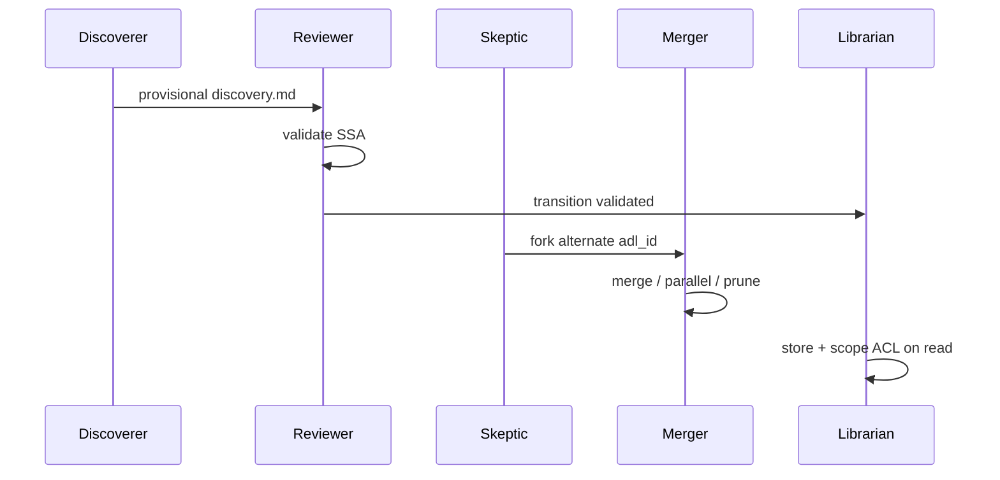

# ADL Lite — Figures

## Figure 1: Concept lifecycle (status machine)

```mermaid
stateDiagram-v2
    [*] --> provisional
    provisional --> validated
    provisional --> deprecated
    provisional --> forked
    provisional --> archived
    validated --> deprecated
    validated --> forked
    validated --> archived
    forked --> validated
    forked --> deprecated
    forked --> archived
    deprecated --> archived
    archived --> [*]
```

## Figure 2: Fork resolution strategies

```mermaid
flowchart TD
    F[Fork detected] --> S{Structural similarity}
    S -->|≥ 90%| M[MERGE]
    S -->|< 90%| P[PARALLEL]
    P --> I{Idle > 180d?}
    I -->|yes| R[PRUNE → archived]
    I -->|no| K[Keep both validated]
```

## Figure 3: L1 / L2 / L3 architecture

```mermaid
flowchart TB
    subgraph L1["L1 YAML Front Matter"]
        ID[adl_id / scope / status]
        META[confidence / mechanism]
    end
    subgraph L2["L2 Markdown Body"]
        PROSE[Discovery prose]
        WIKI["[[Wiki Links]]"]
    end
    subgraph L3["L3 adl:* blocks"]
        REL[adl:relation]
        EV[adl:evidence]
        SEAL[adl:seal]
    end
    subgraph MEM["Hybrid Memory"]
        HOT[Hot — ConceptSkeleton]
        WARM[Warm — SQLite + NetworkX]
        COLD[Cold — archive]
    end
    L1 --> HOT
    L2 --> WARM
    L3 --> WARM
    HOT --> WARM
    WARM --> COLD
```

## Figure 4: Five-agent workflow

```mermaid
sequenceDiagram
    participant D as Discoverer
    participant R as Reviewer
    participant S as Skeptic
    participant M as Merger
    participant L as Librarian

    D->>R: provisional discovery.md
    R->>R: validate SSA
    R->>L: transition validated
    S->>M: fork alternate adl_id
    M->>M: merge / parallel / prune
    L->>L: store + scope ACL on read
```
