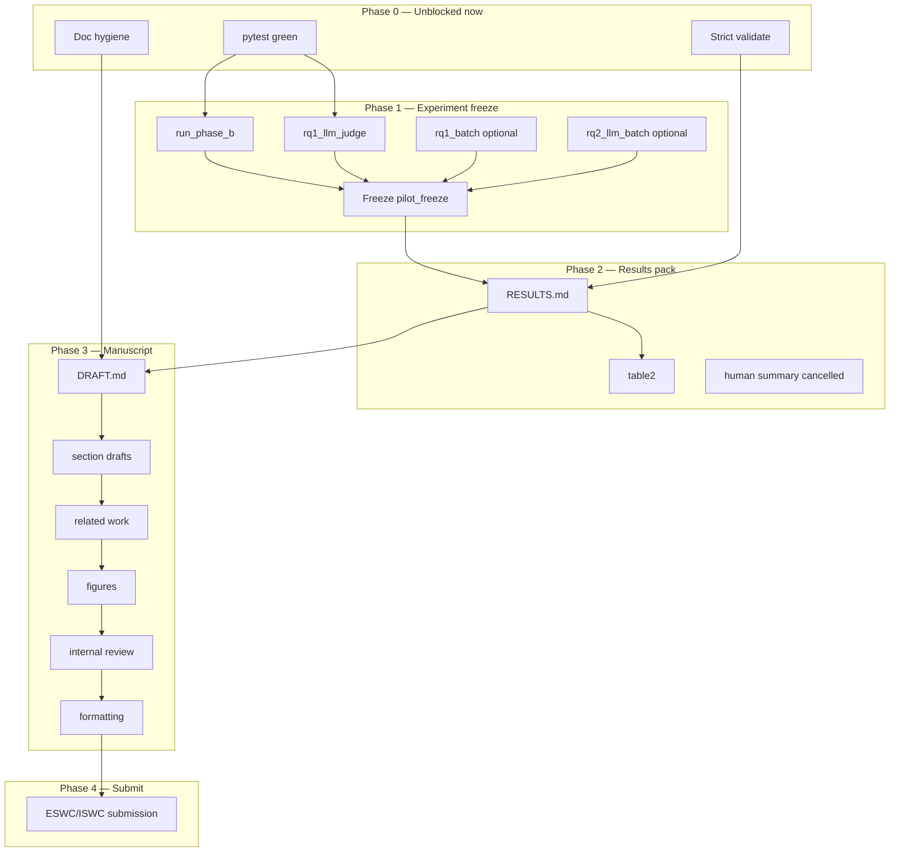

# ADL Lite — Paper Submission Execution Plan

**North-star (2027):** A **submittable ESWC / ISWC 2027** manuscript (`docs/paper/DRAFT.md` + sections), backed by **frozen pilot metrics** (`docs/experiments/RESULTS.md` + JSON summaries) and **green reproducibility gates** (`pytest tests/ -v`, `pytest experiments/ -v`, `python -m experiments.run_phase_b`).

**Backup venue:** AAMAS 2027 (multi-agent consensus framing) — only if SW track timeline or fit fails.

**Decision log (2026-05-24):** **Human RQ1 cancelled** — RQ1 subjective dimension uses **agent / LLM-as-judge only** (fair-plain Δ=0 reported honestly; unstructured plain-LLM contrast retained).

**Companion docs:** [`PRD.md`](PRD.md), [`IMPLEMENTATION_PLAN.md`](IMPLEMENTATION_PLAN.md), [`RESEARCH_STATEMENT.md`](RESEARCH_STATEMENT.md), [`experiments/RESULTS.md`](experiments/RESULTS.md), [`experiments/PHASE_B_PLAN.md`](experiments/PHASE_B_PLAN.md), [`paper/OUTLINE.md`](paper/OUTLINE.md), [`AGENTS.md`](../AGENTS.md).

---

## 1. North-star definition of done

| Artifact | Done when |
|----------|-----------|
| **Paper** | `DRAFT.md` ≤ page limit for target track; claims match frozen `pilot_freeze` block; no “human pending” language; related work + limitations explicit; author list + anonymization policy set |
| **Results** | `RESULTS.md` + `summary_phase_b.json`, `rq1_llm_judge_summary.json`, `rq3_ablation.json`, `table2_results.md` aligned; reproducible from `REPRODUCE.md` / `RESEARCH_LOOP_CHECKLIST.md` |
| **Code** | `pytest tests/ -v` and `pytest experiments/ -v` green; `adl-lite validate --strict examples/*.md` passes; no secrets in git |
| **Repo hygiene** | Venue strings consistent (ESWC/ISWC primary); dataset counts consistent (**20** concepts, **25** queries, **60** RQ4 probes); human RQ1 marked **cancelled** everywhere |

---

## 2. Workstreams

### A. Experiment execution & freeze

| ID | Task | Effort | Owner |
|----|------|--------|-------|
| A1 | Daily smoke: `pytest tests/ -v && pytest experiments/ -v` | S | agent |
| A2 | Phase B pack: `python -m experiments.run_phase_b` → refresh `summary_phase_b.json` | S | agent |
| A3 | RQ1 LLM-judge refresh: `python -m experiments.rq1_llm_judge --summarize-from-template --proxy-only` | M | agent (+ API) |
| A4 | Optional MiMo rediscovery: `source .env && python -m experiments.rq1_batch_discover` (3 scenarios) or `--target-complete N` | M | agent (+ API) |
| A5 | RQ2 LLM batch (if claiming fresh MiMo numbers): `python -m experiments.rq2_llm_batch --n 10` | M | agent |
| A6 | **Freeze** `pilot_freeze` YAML block in `RESULTS.md` + git tag `paper-freeze-YYYY-MM-DD` | S | human |
| A7 | Ontology strict re-verify: `adl-lite validate --strict examples/*.md` | S | agent |

**Blocked by:** A6 waits on A2–A5 only if numbers change; otherwise freeze now with documented API versions.

### B. Results & report

| ID | Task | Effort | Owner |
|----|------|--------|-------|
| B1 | Keep `RESULTS.md` as single source of truth; evidence-ordered summary matches JSON | M | agent |
| B2 | Regenerate `docs/paper/table2_results.md` from frozen summaries | S | agent |
| B3 | Update `rq1_human_summary.json` label → **cancelled** (scaffold retained) | S | agent |
| B4 | `RESEARCH_LOOP_CHECKLIST.md` — check off scripted paths; human RQ1 → cancelled | S | agent |
| B5 | Optional: `experiments/REPRODUCE.md` one-page command card | M | agent |

### C. Paper manuscript

| ID | Task | Effort | Owner |
|----|------|--------|-------|
| C1 | Align `OUTLINE.md` venue → ESWC/ISWC 2027 | S | agent |
| C2 | `DRAFT.md` — remove human-RQ1 pending; tighten RQ1 as secondary LLM-judge | M | agent |
| C3 | `draft_evaluation.md`, `draft_introduction.md`, `draft_conclusion.md` — same claim discipline | M | agent |
| C4 | Related work pass (operational ontology, agentic KG, lightweight KGs) | L | human |
| C5 | Figures: L1/L2/L3 stack, RQ3 ablation table, scope probe diagram (`FIGURES.md`) | M | human |
| C6 | Internal review vs `RESULTS.md` (no number drift) | M | human |
| C7 | Track-specific formatting (LNCS / CEUR) + anonymization | L | human |

### D. Doc & repo hygiene

| ID | Task | Effort | Owner |
|----|------|--------|-------|
| D1 | `RESEARCH_STATEMENT.md` — 25 queries, human RQ1 cancelled | S | agent |
| D2 | `PRD.md` claim discipline snippet | S | agent |
| D3 | `README.md` — pilot table vs aspirational (+15% Recall) footnote | S | agent |
| D4 | `HUMAN_RQ1_PROTOCOL.md` — banner: study cancelled; template kept for audit | S | agent |
| D5 | `IMPLEMENTATION_PLAN.md` checklist — human RQ1 → cancelled | S | agent |
| D6 | `PHASE_B_PLAN.md` — human step optional/cancelled | S | agent |

### E. Reproducibility

| ID | Task | Effort | Owner |
|----|------|--------|-------|
| E1 | `.env.example` documents MiMo + DeepSeek + judge keys; `source .env` documented (no python-dotenv) | S | agent |
| E2 | Pin experiment deps in `pyproject.toml` optional extras `[experiments]` | S | agent |
| E3 | CI: `pytest tests/` + `adl-lite validate examples/*.md` (no API keys) | S | agent |
| E4 | Document API versions used in freeze footnote (model IDs, dates) | S | human |

---

## 3. Dependency graph



**Critical path:** A1 → A2/A3 → A6 → B1 → C2 → C6 → C7 → SUB.

**Parallel to critical path:** D*, E*, C4/C5 can start early with *current* frozen numbers; must re-sync after A6 if metrics change.

---

## 4. Parallel lanes (no file conflict)

These can run **simultaneously** in separate agents/sessions:

| Lane | Tasks | Notes |
|------|-------|-------|
| **Lane 1 — CI / unit** | A1, A7, E3 | Read-only on metrics |
| **Lane 2 — Docs hygiene** | D1–D6, B4, C1 | Markdown only; avoid editing `DRAFT.md` and `RESULTS.md` in same PR without merge order |
| **Lane 3 — API experiments** | A3, A4, A5 | Requires `source .env`; writes `experiments/outputs/`, JSON summaries |
| **Lane 4 — Paper prose** | C4, C5 | Uses frozen table numbers; don’t invent new metrics |
| **Lane 5 — Manuscript sync** | C2, C3, B2 | **Serial within lane:** freeze → RESULTS → DRAFT → table2 |

**Avoid parallel edits to:** `data/eval/human_rq1_template.json` (API lane), `docs/experiments/RESULTS.md` (one writer at a time).

---

## 5. Phased checklist

### Phase 0 — Baseline & hygiene (now → 1 week)

| ✓ | Task | Effort | Owner |
|---|------|--------|-------|
| [x] | pytest tests + experiments green | S | agent |
| [x] | Cancel human RQ1 across docs + summaries | S | agent |
| [x] | Fix venue / query-count / probe-count drift | S | agent |
| [x] | `OUTLINE.md` → ESWC/ISWC | S | agent |
| [x] | Smoke: `rq1_batch_discover --target-complete 1` or proxy | S | agent |

**Definition of done:** All Phase 0 rows checked; no doc says “human RQ1 pending”; CI-equivalent commands pass locally.

### Phase 1 — Metric freeze (1–2 weeks)

| ✓ | Task | Effort | Owner |
|---|------|--------|-------|
| [x] | `run_phase_b` + judge summarize | M | agent |
| [x] | Optional MiMo batch refresh | M | agent |
| [x] | Update `pilot_freeze` + JSON artifacts | S | agent |
| [ ] | Human signs off freeze | S | human |

**Definition of done:** `pilot_freeze` date set; re-running Phase B reproduces same numbers ± floating tolerance; table2 matches JSON.

### Phase 2 — Manuscript complete (2–4 weeks)

| ✓ | Task | Effort | Owner |
|---|------|--------|-------|
| [x] | DRAFT + sections aligned to freeze | L | human+agent |
| [x] | Limitations + threats (fair-plain null, L3-only lift, proxy judges) | M | human |
| [x] | Figures and related work | L | human |

**Definition of done:** External reader can reproduce claims from `RESULTS.md` without opening code; no contradictory RQ ordering.

### Phase 3 — Submission prep (1–2 weeks)

| ✓ | Task | Effort | Owner |
|---|------|--------|-------|
| [ ] | Formatting, anonymization, supplementary (repo URL) | M | human |
| [x] | Final diff: DRAFT vs table2 vs RESULTS | S | agent |
| [ ] | Submit ESWC/ISWC (or AAMAS backup) | S | human |

**Definition of done:** PDF uploaded; artifact links in submission form; git tag matches paper freeze.

---

## 6. Risk register

| Risk | Impact | Mitigation |
|------|--------|------------|
| **Fair-plain RQ1 null (Δ=0)** | Reviewers question SSA value | Lead with ontology + RQ3 L3-only + RQ4; frame RQ1 as “authoring discipline vs unstructured LLM” only; report pooled +1.5 vs plain-LLM with judge caveats |
| **LLM-judge circularity** | Same model family generates and judges | Document proxy judges; fair-plain pairing; human RQ1 explicitly **not** claimed; optional second judge provider in appendix |
| **MiMo / DeepSeek API failures** | Missing RQ1 batch or judge rows | `--backend-proxy` for deterministic smoke; pin commands in REPRODUCE; freeze without re-running if prior JSON complete |
| **RQ2 apples-to-oranges** | Scripted 8 vs MiMo 2.0 misread | Keep caveat in abstract, table2, and evaluation §; never claim efficiency win from batch |
| **RQ3 scenario Δ=0** | Headline recall diluted | Always report q21–q25 L3-only ablation (+1.00) separately |
| **Small n (15 discoveries, 25 queries)** | External validity | Label pilot-limited; Phase 2 roadmap in discussion (not in scope for 2027 submit) |
| **Doc drift (15 vs 25 queries, AAMAS in OUTLINE, RQ4 60 vs 99 probes)** | Desk reject / confusion | Workstream D; single `pilot_freeze` block; RQ4 probes = 3 × indexed concepts (33 → 99) |
| **June slip** | Miss internal deadline | Cut Turtle export and new ontology features; ship frozen pilot + honest limits |

---

## 7. Command reference (reproducibility)

```bash
cd "/Users/michelleye/Documents/Allen's files/adl-lite"
pip install -e ".[dev,experiments]"

# No API keys required
pytest tests/ -v
pytest experiments/ -v
adl-lite validate examples/*.md
adl-lite validate --strict examples/*.md
python -m experiments.run_phase_b

# API keys: copy .env.example → .env, then:
set -a && source .env && set +a

# RQ1 discovery smoke (1 new validator-pass slot)
python -m experiments.rq1_batch_discover --target-complete 1

# RQ1 discovery without API (proxy materialization)
python -m experiments.rq1_batch_discover --backend-proxy --regenerate-all

# LLM-as-judge summarize (proxy judges)
python -m experiments.rq1_llm_judge --summarize-from-template --proxy-only

# Full demo
./scripts/demo_pipeline.sh --scripted
```

---

## 8. Session log

| Date | Action |
|------|--------|
| 2026-05-24 | Created this plan; Phase 0 doc hygiene + smoke tests (see git diff) |
| 2026-05-24 | Phase 1 freeze executed: pytest green, `run_phase_b`, RQ1 proxy judge, `rq3_ablation` refresh; DRAFT/table2/RESULTS aligned; human RQ1 cancelled |
