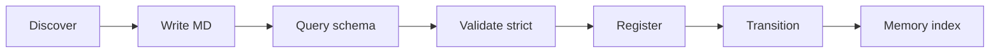

# Agent Workflow — ADL Lite

End-to-end loop for multi-agent concept discovery and consensus.

## Overview



| Step | Actor | Action | Tool |
|------|-------|--------|------|
| 1. Discover | Discoverer | Hypothesize phenomenon, draft L1+L2+L3 | LLM + `prompts/write_discovery.md` (Method E) |
| 2. Write | Discoverer | Save `.md` under scope-appropriate path | File write |
| 3. Query schema | Reviewer / Discoverer | Inspect allowed predicates and transitions before authoring L3 | `adl_ontology_query()` or `adl-lite ontology query` |
| 4. Validate | Reviewer | SSA checks + optional strict predicate registry | `adl-lite validate --strict` or `ADLValidator(strict=True)` |
| 5. Register | Librarian | Append consensus chain entry | `adl-lite consensus register` |
| 6. Transition | Reviewer / Skeptic | `provisional` → `validated` or `forked` | `adl-lite consensus transition` |
| 7. Index | Librarian | Persist to hybrid memory | `adl-lite store --db` |
| 8. Query | Any agent | Graph neighbors with scope ACL | `adl-lite related` |

### Method E → Method D convergence

Authoring follows **Method E** (end-to-end prompting via `prompts/write_discovery.md`): agents draft full L1/L2/L3 Markdown in one pass. Before merge or consensus, the **Reviewer** applies **Method D** (schema-guided extraction): query `adl_core_ontology.yaml` through `OntologyManager` for closed predicate and transition sets, then run strict validation so unknown L3 `relation` values fail before registration. This mirrors the lesson from recent LLM–ontology surveys: relation typing is harder than entity naming; a registry catches hallucinated predicates early.

```python
from adl_lite.tools import adl_ontology_query
from adl_lite.validator import ADLValidator

schema = adl_ontology_query()
print(schema["predicates"])  # closed L3 relation set

# Before writing a transition or L3 block:
check = adl_ontology_query(from_status="forked", to_status="validated")
assert check["is_valid_transition"]

errors = ADLValidator(strict=True).validate_document(doc)
```

CLI equivalent:

```bash
adl-lite ontology query --json
adl-lite ontology query --from-status forked --to-status validated
adl-lite ontology query --predicate isomorphic-to
```

## Scripted 5-agent simulation

For reproducible research runs (no API key):

```bash
python -m experiments.run_sim --scripted
```

Roles:

| Role | Responsibility |
|------|----------------|
| **Discoverer** | Emits provisional discovery MD |
| **Reviewer** | Validates semantics; transitions to `validated` |
| **Skeptic** | Forks alternate `adl_id` when mechanism disputed |
| **Merger** | Resolves fork: merge / parallel / prune |
| **Librarian** | Stores docs, enforces scope on reads |

Log output: `experiments/logs/run_001.jsonl` (one JSON event per line).

## Python API (agents)

```python
from adl_lite.tools import (
    adl_parse,
    adl_validate,
    adl_store,
    adl_query_related,
    adl_ontology_query,
    adl_consensus_register,
    adl_consensus_transition,
)

result = adl_validate("examples/capital_reflux_trap.md")
if result["ok"]:
    adl_consensus_register(path="examples/capital_reflux_trap.md")
    adl_store("examples/capital_reflux_trap.md", db="/tmp/adl.db")
```

## Scope rules

- `public` — readable by any agent scope
- `private/<org>` — only same org scope
- `user/<id>` — only owning user
- `shared/<collab>` — collaboration members only

Use `ADLValidator.validate_scope_access(doc_scope, requester_scope)` before returning document content to an agent.

## Fork workflow

1. Skeptic calls `engine.fork(original_id, fork_id, actor, reason)`.
2. Merger evaluates similarity via `ForkManager.attempt_merge()`:
   - **Merged** (≥90%): validate fork, deprecate or archive original interpretation
   - **Parallel** (<90%): keep both as validated in different contexts
   - **Prune**: archive unreferenced fork after idle period

See `examples/matdo_original.md` + `examples/matdo_fork_kinetic.md`.

## Daily smoke test

```bash
pip install -e ".[dev]"
pytest tests/ -v
adl-lite validate examples/*.md
adl-lite validate --strict examples/*.md
```
