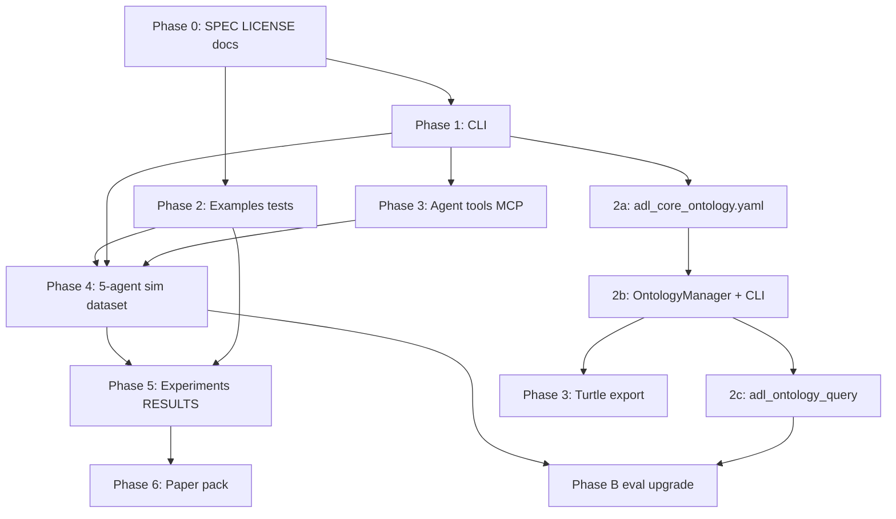

# ADL Lite — Implementation Plan

> **Phase 1 horizon:** 2026-05-23 → 2026-06-30 — **shipped** (see [`PHASE1_CHECKLIST.md`](PHASE1_CHECKLIST.md), releases v0.3.x)  
> **Phase 2+ horizon:** 2026-07-01 → 2026-09-30 — ontology middle layer + Phase B eval + paper pack  
> **Goal (Phase 1):** Runnable toolkit + minimal evidence that ADL Lite beats plain Markdown on at least one research metric.  
> **Goal (Phase 2+):** Centralized semantic schema for agents; optional RDF export — without triple store or OWL reasoner.  
> **Companion docs:** [`PRD.md`](PRD.md) (product milestones), [`proposals/ONTOLOGY_MIDDLE_LAYER.md`](proposals/ONTOLOGY_MIDDLE_LAYER.md) (design), [`SPEC.md`](SPEC.md) (normative syntax)  
> **Origin doc:** [`ADL_Lite_对话全记录.md`](../ADL_Lite_对话全记录.md)

---

## Success criteria (Phase 1 “done”) — ✅ met

A new contributor (not in the original brainstorm) can:

1. Read `docs/SPEC.md` and understand L1/L2/L3 syntax.
2. Run `adl-lite validate examples/*.md` and get clear pass/fail output.
3. Reproduce **one reported number** from `docs/experiments/RESULTS.md` (e.g. ambiguity reduction or scope leak rate).
4. Open `examples/` in Obsidian and read discoveries without tooling.

Evidence: all items checked in [`PHASE1_CHECKLIST.md`](PHASE1_CHECKLIST.md); CI runs `pytest tests/ -v` and `adl-lite validate examples/*.md`.

---

## Success criteria (Phase 2 ontology track)

Ontology track is **done** when ([`PRD.md`](PRD.md) §5):

1. `adl_core_ontology.yaml` is the single source of truth for L3 predicates and status transitions used by validator/consensus.
2. Strict predicate validation is **opt-in** (`ADLValidator(strict=True)` or CLI flag) and documented in [`SPEC.md`](SPEC.md).
3. At least one agent-facing introspection API ships (`adl_ontology_query` in `tools.py`).
4. Open questions in proposal §8 (predicate closure, `mapping_type` taxonomy) are resolved in YAML comments or SPEC.

**Explicit non-goals:** HermiT/Pellet, production triple store, ontology replacing SQLite/NetworkX, cold tier, vector ANN in warm layer — see proposal §6 and [`PRD.md`](PRD.md) §3.4.

---

## Workstreams

| ID | Stream | Owner focus | Phase |
|----|--------|-------------|-------|
| **W1** | Spec & docs | Normative language, provenance, examples | 1 ✅ |
| **W2** | CLI & API | Developer/agent surface | 1 ✅ |
| **W3** | Core library | Parser, memory, consensus hardening | 1 ✅ |
| **W4** | Agent harness | 5-agent sim + MCP optional | 1 ✅ |
| **W5** | Evaluation | Dataset, baselines, RQ1–RQ4 pilots → Phase B | 1 ✅ → ongoing |
| **W6** | Academic | Paper outline, figures, arXiv prep | 1 ✅ → ongoing |
| **W7** | Ontology middle layer | Schema registry, validator integration, agent introspection | 2+ |

Streams **W1–W3** unblock everything else. **W5** depends on **W2 + W4**. **W7** depends on Phase 1 validator/consensus; **2c** depends on **2b**.

---

# Part A — Phase 1 (shipped)

> Historical week-by-week plan below. Status markers reflect codebase as of v0.3.x.

## Phase 0 — Repository foundation (Week 1, days 1–3) ✅

### Deliverables

| Task | Output | Verify | Status |
|------|--------|--------|--------|
| 0.1 Add `LICENSE` (MIT) | `LICENSE` | Matches README | ✅ |
| 0.2 README provenance | Section linking transcript + this plan | Links resolve | ✅ |
| 0.3 Extract normative spec | `docs/SPEC.md` (~2–4 pages from transcript §6–§8) | Covers L1/L2/L3, scopes, statuses, block types | ✅ |
| 0.4 Changelog | `CHANGELOG.md` | 0.1.0 entry | ✅ |
| 0.5 Phase 1 tracker | `docs/PHASE1_CHECKLIST.md` | All Phase 0–6 tasks listed | ✅ |

### `docs/SPEC.md` outline (minimum sections)

1. Document types (`adl_type` enum)
2. Required L1 fields per type
3. L3 block schemas (`adl:relation`, `adl:evidence`, `adl:formal_seal`)
4. Scope URI grammar (`public`, `private/<org>`, …)
5. Status machine (`provisional` → …)
6. Validation rules (pronouns, scope, evidence ref format)
7. Non-goals for v0.1 (Lean4 execution, FAISS required)

**Exit:** Spec readable without opening the 550-line transcript. ✅

---

## Phase 1 — CLI & developer UX (Week 1–2, days 4–10) ✅

### Deliverables

| Task | Output | Verify | Status |
|------|--------|--------|--------|
| 1.1 CLI entry point | `[project.scripts]` → `adl-lite` in `pyproject.toml` | `adl-lite --help` works after `pip install -e ".[dev]"` | ✅ |
| 1.2 `adl-lite parse <path>` | JSON or table summary to stdout | Matches `parse_file()` on example | ✅ |
| 1.3 `adl-lite validate <path>…` | Exit code 0/1, prints errors | Fails on intentional bad fixture | ✅ |
| 1.4 `adl-lite store <path> --db <file>` | Persists to `ADLMemory` | Second run retrieves skeleton | ✅ |
| 1.5 `adl-lite related <id> --db <file>` | Graph neighbors | Matches `mem.find_related()` | ✅ |
| 1.6 `adl-lite consensus …` subcommands | `register`, `transition`, `verify` | Integration test passes | ✅ |

### Suggested CLI layout

```
adl-lite parse FILE [-o json|text]
adl-lite validate FILE [FILE ...]
adl-lite store FILE --db PATH
adl-lite related ADL_ID --db PATH [--depth N]
adl-lite consensus register FILE --db PATH
adl-lite consensus transition ADL_ID --to STATUS --actor ID --reason TEXT
adl-lite consensus verify ADL_ID
```

### Tests

- `tests/test_cli.py` — invoke via `subprocess` or `click.testing.CliRunner`
- Golden: `tests/fixtures/invalid_pronoun.md` → validate fails

**Exit:** All README “Quick Start” commands have CLI equivalents documented. ✅

---

## Phase 2 — Library hardening & examples (Week 2, days 8–14) ✅

> *Note: Phase 1 “Phase 2” (library hardening) — not to be confused with product Phase 2 (ontology track) below.*

### Deliverables

| Task | Output | Verify | Status |
|------|--------|--------|--------|
| 2.1 Three new examples | `examples/*.md` (MATDO fork pair, attention residual, public concept) | Each passes `adl-lite validate` | ✅ (5 files) |
| 2.2 Golden-file parser tests | `tests/test_golden_parser.py` | `pytest` stable | ✅ |
| 2.3 Wiki-link → relation (optional) | `extract_wiki_links()` on parser | Unit test: links extracted | ✅ |
| 2.4 Round-trip (stretch) | `adl_lite/serialize.py` or `document.to_markdown()` | Parse → serialize → parse ≈ equal | ⏸ deferred |
| 2.5 Scope ACL matrix tests | `tests/test_scope_access.py` | All public/private/user rules from validator | ✅ |
| 2.6 Consensus fork scenarios | `tests/test_consensus_forks.py` | merge / parallel / prune paths | ✅ |

### Example authoring checklist (per file)

- [x] L1: `adl_id`, `scope`, `status`, `confidence`, `provisional_names`
- [x] L2: discovery statement, no forbidden pronouns in definition paragraph
- [x] L3: ≥1 `adl:relation`, ≥1 `adl:evidence`
- [x] At least one cross-scope link (`adl://public/...`) if private doc

**Exit:** ≥4 validated examples; test count ≥20. ✅

---

## Phase 3 — Agent integration (Week 3, days 15–21) ✅

### Deliverables

| Task | Output | Verify | Status |
|------|--------|--------|--------|
| 3.1 Python tool module | `adl_lite/tools.py` — thin wrappers for harness | Importable functions match CLI semantics | ✅ |
| 3.2 Prompt template | `prompts/write_discovery.md` | Manual: one LLM run produces valid file | ✅ |
| 3.3 Agent guide update | `AGENTS.md` — CLI commands, scope rules, example paths | — | ✅ |
| 3.4 MCP server (optional P1) | `scripts/mcp_adl.py` exposing parse/validate/store | Cursor can call tools on `examples/` | ✅ |

### MCP tools (built)

| Tool | Args | Returns |
|------|------|---------|
| `adl_parse` | `path` | skeleton + relation count |
| `adl_validate` | `path` | errors[] |
| `adl_query_related` | `adl_id`, `scope` | neighbor list |

**Exit:** Document one “agent loop” in `docs/AGENT_WORKFLOW.md`: discover → write MD → validate → register → transition. ✅

---

## Phase 4 — 5-agent simulation & dataset (Week 4, days 22–28) ✅

### Deliverables

| Task | Output | Verify | Status |
|------|--------|--------|--------|
| 4.1 Sim harness | `experiments/harness.py` | Runs without API key (scripted mode) | ✅ |
| 4.2 Scripted agents (5 roles) | discoverer, reviewer, skeptic, merger, librarian | One full run logs transitions | ✅ |
| 4.3 LLM-backed mode (stretch) | `experiments/llm_harness.py` + env keys | One discovery end-to-end | ✅ |
| 4.4 AML mini dataset | `data/aml/` — 20 concepts, 15 queries | Loader tests | ✅ |
| 4.5 Index all dataset docs | `ADLMemory` populated | `related` queries return expected ids | ✅ |

### Agent roles (minimum behavior)

| Agent | Action |
|-------|--------|
| Discoverer | Emits provisional `discovery` MD |
| Reviewer | `transition` → `validated` or requests edits |
| Skeptic | `fork` alternate `adl_id` |
| Merger | Resolves fork (merge/parallel/prune) |
| Librarian | Enforces scope on read paths |

**Exit:** `python -m experiments.run_sim --scripted` produces `experiments/logs/run_001.jsonl`. ✅

---

## Phase 5 — Evaluation & baselines (Week 5, days 29–35) ✅

### Deliverables

| Task | Output | Verify | Status |
|------|--------|--------|--------|
| 5.1 Baseline: plain Markdown | `experiments/baselines/plain_markdown.py` | Same dataset indexed | ✅ |
| 5.2 Baseline: YAML-only wiki | `experiments/baselines/yaml_wiki.py` | — | ✅ |
| 5.3 Metric: RQ1 ambiguity | `experiments/rq1_ambiguity.py` | One % or score in RESULTS | ✅ |
| 5.4 Metric: RQ2 consensus rounds | `experiments/rq2_consensus.py` | Compare ADL vs baseline | ✅ |
| 5.5 Metric: RQ3 retrieval | `experiments/rq3_retrieval.py` | Recall@10 on 15 queries | ✅ |
| 5.6 Metric: RQ4 leakage | `experiments/rq4_leakage.py` | Leak count = 0 for ADL | ✅ |
| 5.7 Results doc | `docs/experiments/RESULTS.md` | Numbers + how to reproduce | ✅ |

### Experiment command target

```bash
pytest experiments/ -v   # or
python -m experiments.run_all --db data/aml/index.db
```

**Exit:** RESULTS.md contains ≥1 statistically meaningful win (or honest negative result documented). ✅

**Phase B upgrade** (paper-grade): see [`docs/experiments/PHASE_B_PLAN.md`](experiments/PHASE_B_PLAN.md) — runs in parallel with ontology track.

---

## Phase 6 — Academic packaging (Week 6, days 36–42) ✅

### Deliverables

| Task | Output | Verify | Status |
|------|--------|--------|--------|
| 6.1 Paper outline | `docs/paper/OUTLINE.md` — intro, RQs, method, eval | Maps to RESULTS | ✅ |
| 6.2 Figure: lifecycle | Status diagram | `docs/paper/FIGURES.md` | ✅ |
| 6.3 Figure: architecture | L1/L2/L3 + memory tiers | — | ✅ |
| 6.4 Related work table | `docs/paper/RELATED_WORK.md` | Updated 2026; LLM ontology §7 in `draft_related_work.md` | ✅ |
| 6.5 Research statement excerpt | `docs/RESEARCH_STATEMENT.md` (2 pages) | Usable for 申博 outreach | ✅ |
| 6.6 arXiv draft stub (stretch) | `docs/paper/DRAFT.md` + section stubs | Ontology §2.7/§3.9/§4.6 + Phase B numbers synced (2026-05-24) | ✅ (in progress) |

**Exit:** GitHub repo link is portfolio-ready with RESULTS + SPEC + demo. ✅

---

## Phase 1 weekly calendar (completed)

| Week | Dates (2026) | Primary focus | Ship signal |
|------|----------------|---------------|-------------|
| **1** | 5.23 – 5.29 | Phase 0 + Phase 1 start | `adl-lite validate` works |
| **2** | 5.30 – 6.05 | Phase 1 finish + Phase 2 | CLI complete, 4 examples |
| **3** | 6.06 – 6.12 | Phase 3 + Phase 4 start | Agent workflow doc |
| **4** | 6.13 – 6.19 | Phase 4 finish | Scripted 5-agent log |
| **5** | 6.20 – 6.26 | Phase 5 | `RESULTS.md` with numbers |
| **6** | 6.27 – 6.30 | Phase 6 + buffer | Phase 1 checklist closed |

---

# Part B — Phase 2+ (ontology & eval)

> Product phases per [`PRD.md`](PRD.md) §3–§5. Design detail: [`proposals/ONTOLOGY_MIDDLE_LAYER.md`](proposals/ONTOLOGY_MIDDLE_LAYER.md).

## Architecture placement

```
Agents / CLI / MCP
        ↓
Ontology semantic layer     ← W7 (2a–2c)
        ↓
ADLValidator + ConsensusEngine   ← v0.1 (~60–70% of ontology duties today)
        ↓
ADLMemory (SQLite + NetworkX)
        ↓
Markdown (L1 / L2 / L3)
```

Ontology **sits above** warm storage; it does **not** replace SQLite or NetworkX.

---

## Milestone 2a — Core ontology YAML + predicate validation (~1 week)

**Depends on:** Phase 1 validator, existing L3 examples in `examples/` and `data/aml/`.

### Deliverables

| Task | Output | Files to touch | Verify |
|------|--------|----------------|--------|
| 2a.1 Draft core schema | `adl_core_ontology.yaml` at repo root or `adl_lite/` | New: `adl_core_ontology.yaml` | YAML loads; documents classes, predicates, `mapping_type`, status graph, scope prefixes |
| 2a.2 Mirror existing enums | Classes align with `ADLType` in `models.py` | `adl_lite/models.py` (read-only reference) | Every `adl_type` in examples has a class entry |
| 2a.3 Predicate registry | Closed core set: `isomorphic-to`, `specialisation-of`, … from examples + AML corpus | YAML + comments for open questions (proposal §8) | All predicates in `examples/*.md` listed |
| 2a.4 Status transition graph | YAML mirrors `ConsensusEngine._is_valid_transition` | Read `consensus.py`; encode in YAML | Graph matches current behavior (no drift) |
| 2a.5 Validator integration (strict) | Unknown L3 `relation` fails when `strict=True` | `adl_lite/validator.py` | Default `strict=False` unchanged; corpus still passes |
| 2a.6 SPEC cross-ref | Predicate rules documented | `docs/SPEC.md` §validation | Links to YAML as normative registry |

### Tests

| Test | Purpose |
|------|---------|
| `tests/test_ontology_yaml.py` | YAML loads; required keys present; predicates non-empty |
| `tests/test_ontology_predicates.py` | Known predicate passes; `relation: "similar"` fails in strict mode |
| `tests/fixtures/invalid_predicate.md` | Golden fail for strict validate |

### Verification commands

```bash
pytest tests/test_ontology_yaml.py tests/test_ontology_predicates.py -v
adl-lite validate examples/*.md                    # default: pass
adl-lite validate --strict examples/*.md           # pass on corpus (after 2a.3 complete)
adl-lite validate --strict tests/fixtures/invalid_predicate.md  # exit 1
```

**Exit:** Single YAML artifact is authoritative for predicates and transitions; strict mode opt-in; proposal issue `feat(ontology): ADL Core Ontology YAML + predicate validation (Path A Phase 2a)` closable.

---

## Milestone 2b — OntologyManager + CLI (~1 week)

**Depends on:** 2a.

### Deliverables

| Task | Output | Files to touch | Verify |
|------|--------|----------------|--------|
| 2b.1 `OntologyManager` | Load YAML; query API | New: `adl_lite/ontology.py` | `list_predicates()`, `allowed_transitions(status)`, `resolve_uri(...)` |
| 2b.2 Single transition source | `ConsensusEngine` reads transitions from manager (no duplicate logic) | `consensus.py`, `ontology.py` | Tests prove validator + consensus agree with YAML |
| 2b.3 Validator wiring | Manager injected or lazy-loaded in `ADLValidator` | `validator.py` | Strict predicate check uses manager registry |
| 2b.4 CLI subcommand | `adl-lite ontology validate` (or `adl-lite ontology show`) | `adl_lite/cli.py` | Prints schema summary / validates YAML integrity |
| 2b.5 Public API export | `from adl_lite import OntologyManager` (optional) | `adl_lite/__init__.py` | Importable |

### Tests

| Test | Purpose |
|------|---------|
| `tests/test_ontology_manager.py` | API surface; transitions match YAML |
| `tests/test_consensus_ontology_sync.py` | No drift between `ConsensusEngine` and manager |
| `tests/test_cli.py` (extend) | `adl-lite ontology validate` exit 0 |

### Verification commands

```bash
pytest tests/test_ontology_manager.py tests/test_consensus_ontology_sync.py -v
adl-lite ontology validate
python -c "from adl_lite.ontology import OntologyManager; m=OntologyManager(); print(m.allowed_transitions('forked'))"
```

**Exit:** Agents can introspect transitions without reading Python source; one source of truth for status graph.

---

## Milestone 2c — Agent introspection tool (~3 days)

**Depends on:** 2b.

### Deliverables

| Task | Output | Files to touch | Verify |
|------|--------|----------------|--------|
| 2c.1 `adl_ontology_query` | Python tool: predicates, transitions, scope grammar | `adl_lite/tools.py` | Harness can ask “legal transition from `forked`?” |
| 2c.2 MCP extension (optional) | `adl_ontology_query` in `scripts/mcp_adl.py` | `scripts/mcp_adl.py` | JSON response matches tool |
| 2c.3 Agent docs | Workflow note for schema-aware authoring | `docs/AGENT_WORKFLOW.md` | One worked example |
| 2c.4 Eval hook (optional RQ) | Log invalid L3 writes in 5-agent sim | `experiments/harness.py` | Compare strict on vs off (proposal §8) |

### Tests

| Test | Purpose |
|------|---------|
| `tests/test_tools_ontology.py` | Tool returns same data as `OntologyManager` |

### Verification commands

```bash
pytest tests/test_tools_ontology.py -v
python -c "from adl_lite.tools import adl_ontology_query; print(adl_ontology_query('transitions', status='forked'))"
```

**Exit:** At least one agent-facing introspection API ships; PRD §3.3 milestone 2c criteria met.

---

## Product Phase 3 — Turtle export & paper freeze (Q3–Q4 2026)

**Depends on:** 2b minimum; 2c recommended. Demand signal for Path B.

### Deliverables

| Task | Output | Files to touch | Verify |
|------|--------|----------------|--------|
| 3.1 Turtle export stub | One-way export: corpus + core ontology → `.ttl` | New: `adl_lite/export/turtle.py` or `adl_lite/rdf_export.py` | Valid Turtle (manual or `rdflib` parse) |
| 3.2 Export CLI | `adl-lite export turtle --out PATH` | `cli.py` | Exports `examples/` + ontology |
| 3.3 README/PRD note | Export-only; no embedded reasoner | `README.md`, `PRD.md` | No HermiT claims |
| 3.4 Paper pack freeze | Draft vs `RESULTS.md` | `docs/paper/DRAFT.md` | AAMAS template ready |
| 3.5 SPARQL/SHACL (stretch) | Only if export proves useful | TBD | Deferred by default |

### Tests

| Test | Purpose |
|------|---------|
| `tests/test_turtle_export.py` | Export runs; output parses as Turtle |

### Verification commands

```bash
adl-lite export turtle --out /tmp/adl_export.ttl
pytest tests/test_turtle_export.py -v
# Optional: rdflib.Graph().parse('/tmp/adl_export.ttl', format='turtle')
```

**Exit:** Path B evaluated; documented as interoperability-only.

---

## Phase 2+ weekly calendar (default pacing)

| Week | Dates (2026) | Primary focus | Ship signal |
|------|----------------|---------------|-------------|
| **7** | 7.01 – 7.07 | 2a YAML + strict predicate tests | `invalid_predicate.md` fails `--strict` |
| **8** | 7.08 – 7.14 | 2b OntologyManager + CLI | `adl-lite ontology validate` |
| **9** | 7.15 – 7.21 | 2c tools + Phase B eval parallel | `adl_ontology_query` in harness |
| **10–12** | 7.22 – 8.15 | Phase B experiments + ontology ablation | Updated `RESULTS.md` |
| **13–17** | 8.16 – 9.30 | Paper draft + optional 3.x Turtle | `DRAFT.md` frozen; export stub if needed |

Eval detail: [`docs/experiments/PHASE_B_PLAN.md`](experiments/PHASE_B_PLAN.md).

---

## Dependency graph (Phase 1 + 2+)



---

## Explicitly deferred (unchanged or post Phase 3)

| Item | Reason |
|------|--------|
| OWL reasoner (HermiT, Pellet) | Export-only Path B; no runtime inference — [`PRD.md`](PRD.md) §3.4 |
| Production triple store / SPARQL endpoint | Pilot scale; SQL + NetworkX sufficient |
| Ontology replacing SQLite/NetworkX | Middle layer only — proposal §2 |
| Automatic cross-domain inference | `isomorphic-to` is asserted, not inferred |
| Lean4 / Coq proof execution | No RQ depends on it yet |
| FAISS / vector ANN in warm layer | Phase B uses TF-IDF; add when RQ3 needs semantic ANN |
| Full S-expression ADL | Splits ecosystem; Markdown path is the product |
| Cold tier operational | Spec §9 — deferred |
| Profiling Agent / Harness product | Separate repo or vision doc only |
| Production AML pipeline integration | Research sim sufficient |
| Round-trip serialize (Phase 1 stretch) | Low priority vs ontology 2a–2c |

---

## Risks & mitigations

| Risk | Mitigation |
|------|------------|
| Transition logic drift (YAML vs `ConsensusEngine`) | Single source in 2b; `test_consensus_ontology_sync.py` |
| Strict mode breaks LLM-authored docs | Default `strict=False`; document in SPEC + AGENT_WORKFLOW |
| Predicate closure too rigid for domains | YAML `domain/` prefix extension; resolve in proposal §8 before locking |
| Scope creep into OWL stack | Time-box Path B to export stub; no reasoner in repo |
| Negative ontology ablation | Log invalid L3 rate in sim; publish honestly in RESULTS |
| June-style slip on paper | Cut Turtle/SPARQL; ship 2a–2c + frozen draft |

---

## Checklists

### Phase 1 — closed

See [`PHASE1_CHECKLIST.md`](PHASE1_CHECKLIST.md) (all items checked).

### Phase 2 ontology (copy to issue)

#### 2a (complete — Milestone 2a, 2026-05)
- [x] `adl_lite/adl_core_ontology.yaml` — classes, predicates, transitions, scopes
- [x] `adl_lite/ontology.py` — `OntologyManager` (`list_predicates`, `allowed_transitions`, …)
- [x] Strict predicate validation in `validator.py` + CLI `adl-lite validate --strict`
- [x] Strict `mapping_type` required on `isomorphic-to` (values from YAML)
- [x] `tests/test_ontology.py`, `tests/fixtures/invalid_predicate.md`, `invalid_isomorphic_no_mapping.md`
- [x] Harness ablation logging (`strict_ontology` / `ADL_STRICT_ONTOLOGY`)
- [x] SPEC §7.1–7.2 links to registry + `--strict` behavior
- [x] `ConsensusEngine` reads transitions from `OntologyManager` / YAML

#### 2b (complete — Milestone 2b, 2026-05)
- [x] `adl_lite/ontology.py` — `OntologyManager` (`is_valid_transition`, `allowed_mapping_types`, …)
- [x] `ConsensusEngine` reads transitions from manager (no duplicate graph)
- [x] `adl-lite ontology validate` CLI (+ `--examples` / `--aml`)
- [x] Sync tests vs YAML (`test_ontology.py`, `test_cli.py`)
- [ ] `resolve_uri` / richer manager API (optional)
- [ ] Dedicated `test_ontology_manager.py` split (optional; covered in `test_ontology.py`)

#### 2c (complete — Milestone 2c, 2026-05)
- [x] `adl_ontology_query` in `tools.py` (predicates, transitions, scopes, mapping types)
- [x] `adl-lite ontology query` CLI (+ `--json`, filters)
- [x] MCP `adl_ontology_query` in `scripts/mcp_adl.py`
- [x] AGENT_WORKFLOW schema query step + worked example
- [x] Strict-mode sim ablation in `RESULTS.md`
- [x] `tests/test_tools_ontology.py`

#### Phase 3 (stretch)
- [ ] `adl-lite export turtle`
- [ ] `tests/test_turtle_export.py`
- [ ] Paper `DRAFT.md` frozen vs Phase B RESULTS (ontology §2.7/§3.9/§4.6 drafted 2026-05-24; human RQ1 ratings pending)

---

## Next action (Phase 2 start)

1. Open GitHub issue: `feat(ontology): ADL Core Ontology YAML + predicate validation (Path A Phase 2a)` (title from proposal §8).
2. Inventory predicates from `examples/*.md` and `data/aml/concepts/` → draft `adl_core_ontology.yaml` (~half day).
3. Add `tests/fixtures/invalid_predicate.md` + strict-mode validator hook (~1 day).
4. Run daily smoke: `pytest tests/ -v && adl-lite validate examples/*.md`.

Parallel track: Phase B eval per [`PHASE_B_PLAN.md`](experiments/PHASE_B_PLAN.md) does not block 2a.
