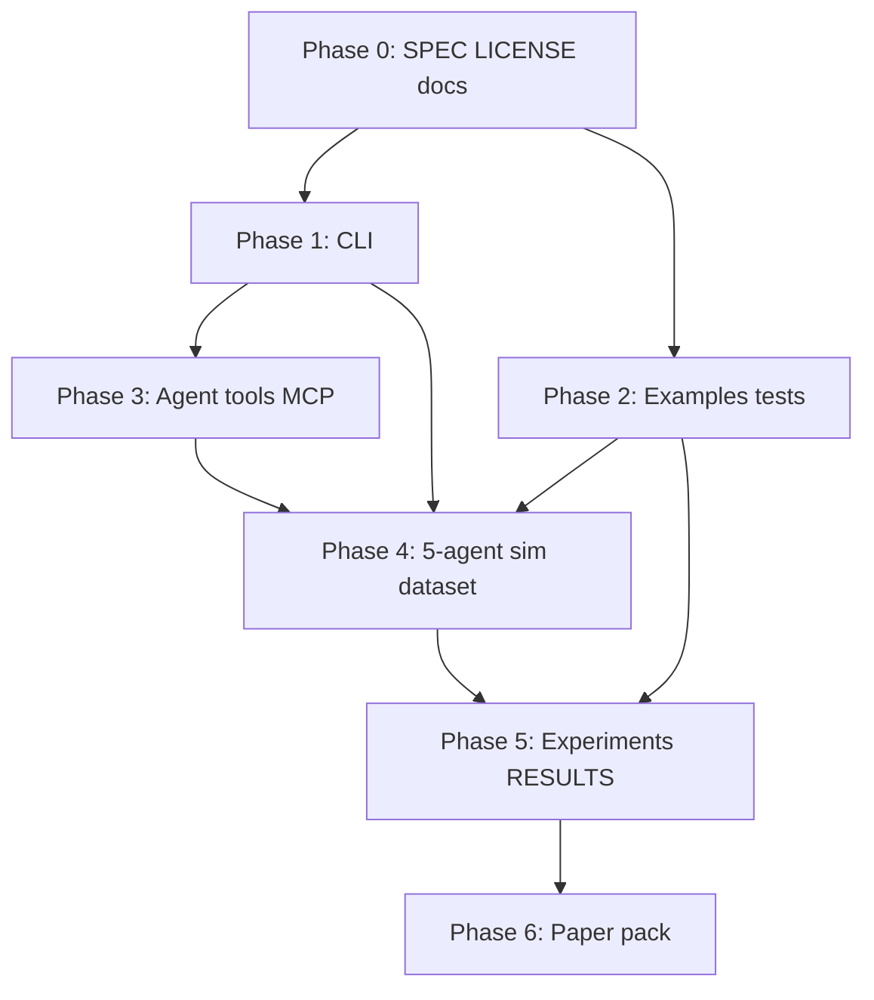

# ADL Lite — Implementation Plan

> **Horizon:** 2026-05-23 → 2026-06-30 (Phase 1 per design transcript)  
> **Goal:** Runnable toolkit + minimal evidence that ADL Lite beats plain Markdown on at least one research metric.  
> **Origin doc:** [`ADL_Lite_对话全记录.md`](../ADL_Lite_对话全记录.md)

---

## Success criteria (Phase 1 “done”)

A new contributor (not in the original brainstorm) can:

1. Read `docs/SPEC.md` and understand L1/L2/L3 syntax.
2. Run `adl-lite validate examples/*.md` and get clear pass/fail output.
3. Reproduce **one reported number** from `docs/experiments/RESULTS.md` (e.g. ambiguity reduction or scope leak rate).
4. Open `examples/` in Obsidian and read discoveries without tooling.

---

## Workstreams

| ID | Stream | Owner focus |
|----|--------|-------------|
| **W1** | Spec & docs | Normative language, provenance, examples |
| **W2** | CLI & API | Developer/agent surface |
| **W3** | Core library | Parser, memory, consensus hardening |
| **W4** | Agent harness | 5-agent sim + MCP optional |
| **W5** | Evaluation | Dataset, baselines, RQ1–RQ4 pilots |
| **W6** | Academic | Paper outline, figures, arXiv prep |

Streams **W1–W3** unblock everything else. **W5** depends on **W2 + W4**.

---

## Phase 0 — Repository foundation (Week 1, days 1–3)

### Deliverables

| Task | Output | Verify |
|------|--------|--------|
| 0.1 Add `LICENSE` (MIT) | `LICENSE` | Matches README |
| 0.2 README provenance | Section linking transcript + this plan | Links resolve |
| 0.3 Extract normative spec | `docs/SPEC.md` (~2–4 pages from transcript §6–§8) | Covers L1/L2/L3, scopes, statuses, block types |
| 0.4 Changelog | `CHANGELOG.md` | 0.1.0 entry |
| 0.5 Phase 1 tracker | GitHub issue or `docs/PHASE1_CHECKLIST.md` | All Phase 0–3 tasks listed |

### `docs/SPEC.md` outline (minimum sections)

1. Document types (`adl_type` enum)
2. Required L1 fields per type
3. L3 block schemas (`adl:relation`, `adl:evidence`, `adl:formal_seal`)
4. Scope URI grammar (`public`, `private/<org>`, …)
5. Status machine (`provisional` → …)
6. Validation rules (pronouns, scope, evidence ref format)
7. Non-goals for v0.1 (Lean4 execution, FAISS required)

**Exit:** Spec readable without opening the 550-line transcript.

---

## Phase 1 — CLI & developer UX (Week 1–2, days 4–10)

### Deliverables

| Task | Output | Verify |
|------|--------|--------|
| 1.1 CLI entry point | `[project.scripts]` → `adl-lite` in `pyproject.toml` | `adl-lite --help` works after `pip install -e ".[dev]"` |
| 1.2 `adl-lite parse <path>` | JSON or table summary to stdout | Matches `parse_file()` on example |
| 1.3 `adl-lite validate <path>…` | Exit code 0/1, prints errors | Fails on intentional bad fixture |
| 1.4 `adl-lite store <path> --db <file>` | Persists to `ADLMemory` | Second run retrieves skeleton |
| 1.5 `adl-lite related <id> --db <file>` | Graph neighbors | Matches `mem.find_related()` |
| 1.6 `adl-lite consensus …` subcommands | `register`, `transition`, `verify` | Integration test passes |

### Suggested CLI layout

```
adl-lite parse FILE [-o json|text]
adl-lite validate FILE [FILE ...]
adl-lite store FILE --db PATH
adl-lite related ADL_ID --db PATH [--depth N]
adl-lite consensus register FILE --db PATH
adl-lite consensus transition ADL_ID --to STATUS --actor ID --reason TEXT
adl-lite consensus verify ADL_ID
```

### Tests

- `tests/test_cli.py` — invoke via `subprocess` or `click.testing.CliRunner`
- Golden: `tests/fixtures/invalid_pronoun.md` → validate fails

**Exit:** All README “Quick Start” commands have CLI equivalents documented.

---

## Phase 2 — Library hardening & examples (Week 2, days 8–14)

### Deliverables

| Task | Output | Verify |
|------|--------|--------|
| 2.1 Three new examples | `examples/*.md` (e.g. MATDO, attention residual, one public concept) | Each passes `adl-lite validate` |
| 2.2 Golden-file parser tests | `tests/golden/*.json` from examples | `pytest` stable |
| 2.3 Wiki-link → relation (optional) | Parser or post-pass extracts `[[slug]]` | Unit test: 2 links → 2 edges |
| 2.4 Round-trip (stretch) | `adl_lite/serialize.py` or `document.to_markdown()` | Parse → serialize → parse ≈ equal |
| 2.5 Scope ACL matrix tests | `tests/test_scope_access.py` | All public/private/user rules from validator |
| 2.6 Consensus fork scenarios | `tests/test_consensus_forks.py` | merge / parallel / prune paths |

### Example authoring checklist (per file)

- [ ] L1: `adl_id`, `scope`, `status`, `confidence`, `provisional_names`
- [ ] L2: discovery statement, no forbidden pronouns in definition paragraph
- [ ] L3: ≥1 `adl:relation`, ≥1 `adl:evidence`
- [ ] At least one cross-scope link (`adl://public/...`) if private doc

**Exit:** ≥4 validated examples; test count ≥20.

---

## Phase 3 — Agent integration (Week 3, days 15–21)

### Deliverables

| Task | Output | Verify |
|------|--------|--------|
| 3.1 Python tool module | `adl_lite/tools.py` — thin wrappers for harness | Importable functions match CLI semantics |
| 3.2 Prompt template | `prompts/write_discovery.md` | Manual: one LLM run produces valid file |
| 3.3 Agent guide update | `AGENTS.md` — CLI commands, scope rules, example paths | — |
| 3.4 MCP server (optional P1) | `mcp_server/` or script exposing parse/validate/store | Cursor can call tools on `examples/` |

### MCP tools (if built)

| Tool | Args | Returns |
|------|------|---------|
| `adl_parse` | `path` | skeleton + relation count |
| `adl_validate` | `path` | errors[] |
| `adl_query_related` | `adl_id`, `scope` | neighbor list |

**Exit:** Document one “agent loop” in `docs/AGENT_WORKFLOW.md`: discover → write MD → validate → register → transition.

---

## Phase 4 — 5-agent simulation & dataset (Week 4, days 22–28)

### Deliverables

| Task | Output | Verify |
|------|--------|--------|
| 4.1 Sim harness | `sim/` or `experiments/harness.py` | Runs without API key (scripted mode) |
| 4.2 Scripted agents (5 roles) | discoverer, reviewer, skeptic, merger, librarian | One full run logs transitions |
| 4.3 LLM-backed mode (stretch) | Config + env `OPENAI_API_KEY` etc. | One discovery end-to-end |
| 4.4 AML mini dataset | `data/aml/` — 20 concepts, 15 queries (JSON manifest) | Loader tests |
| 4.5 Index all dataset docs | `ADLMemory` populated | `related` queries return expected ids |

### Agent roles (minimum behavior)

| Agent | Action |
|-------|--------|
| Discoverer | Emits provisional `discovery` MD |
| Reviewer | `transition` → `validated` or requests edits |
| Skeptic | `fork` alternate `adl_id` |
| Merger | Resolves fork (merge/parallel/prune) |
| Librarian | Enforces scope on read paths |

### Scripted mode first

Use fixed MD templates + deterministic transitions so **W5 experiments** are reproducible before spending tokens.

**Exit:** `python -m experiments.run_sim --scripted` produces `experiments/logs/run_001.jsonl`.

---

## Phase 5 — Evaluation & baselines (Week 5, days 29–35)

### Deliverables

| Task | Output | Verify |
|------|--------|--------|
| 5.1 Baseline: plain Markdown | Strip L3 blocks / use generic YAML only | Same dataset indexed |
| 5.2 Baseline: YAML-only wiki | LLM Wiki style front matter, no `adl:*` | — |
| 5.3 Metric: RQ1 ambiguity | Script + rubric in `experiments/rq1_ambiguity.py` | One % or score in RESULTS |
| 5.4 Metric: RQ2 consensus rounds | Count transitions to `validated` | Compare ADL vs baseline |
| 5.5 Metric: RQ3 retrieval | Recall@10 on 15 queries | ADL vs baseline table |
| 5.6 Metric: RQ4 leakage | Probe cross-scope reads | Leak count = 0 for ADL |
| 5.7 Results doc | `docs/experiments/RESULTS.md` | Numbers + how to reproduce |

### Experiment command target

```bash
pytest experiments/ -v   # or
python -m experiments.run_all --db data/aml/index.db
```

**Exit:** RESULTS.md contains ≥1 statistically meaningful win (or honest negative result documented).

---

## Phase 6 — Academic packaging (Week 6, days 36–42, overlaps Phase 5)

### Deliverables

| Task | Output | Verify |
|------|--------|--------|
| 6.1 Paper outline | `docs/paper/OUTLINE.md` — intro, RQs, method, eval | Maps to RESULTS |
| 6.2 Figure: lifecycle | Status diagram (mermaid or SVG) | In README or paper |
| 6.3 Figure: architecture | L1/L2/L3 + memory tiers | — |
| 6.4 Related work table | From transcript §6.1, updated 2026 | — |
| 6.5 Research statement excerpt | `docs/RESEARCH_STATEMENT.md` (2 pages) | Usable for 申博 outreach |
| 6.6 arXiv draft stub (stretch) | `docs/paper/draft.md` | — |

**Exit:** GitHub repo link is portfolio-ready with RESULTS + SPEC + demo GIF optional.

---

## Weekly calendar (default pacing)

| Week | Dates (2026) | Primary focus | Ship signal |
|------|----------------|---------------|-------------|
| **1** | 5.23 – 5.29 | Phase 0 + Phase 1 start | `adl-lite validate` works |
| **2** | 5.30 – 6.05 | Phase 1 finish + Phase 2 | CLI complete, 4 examples |
| **3** | 6.06 – 6.12 | Phase 3 + Phase 4 start | Agent workflow doc |
| **4** | 6.13 – 6.19 | Phase 4 finish | Scripted 5-agent log |
| **5** | 6.20 – 6.26 | Phase 5 | `RESULTS.md` with numbers |
| **6** | 6.27 – 6.30 | Phase 6 + buffer | Phase 1 checklist closed |

---

## Dependency graph



---

## Explicitly deferred (post Phase 1)

| Item | Reason |
|------|--------|
| Lean4 / Coq proof execution | No RQ depends on it yet |
| FAISS / vector ANN in warm layer | Add when RQ3 needs semantic search beyond graph |
| Full S-expression ADL | Splits ecosystem; Markdown path is the product |
| Profiling Agent / Harness product | Separate repo or `docs/vision.md` only |
| Production AML pipeline integration | Research sim sufficient |

---

## Risks & mitigations

| Risk | Mitigation |
|------|------------|
| Scope creep into Harness | Time-box; only `docs/vision.md` for non-ADL ideas |
| Validator too strict for LLMs | `ADLValidator(strict=False)` default; ablation with strict on |
| Negative experiment results | Publish in RESULTS anyway; narrow claims |
| LLM sim non-reproducible | **Scripted mode** is source of truth for paper numbers |
| June 30 slip | Cut MCP and round-trip; keep CLI + RESULTS + 3 examples |

---

## Phase 1 checklist (copy to issue)

### Week 1–2
- [ ] LICENSE, CHANGELOG, SPEC.md, README provenance
- [ ] CLI: parse, validate, store, related, consensus
- [ ] `tests/test_cli.py` + invalid fixture

### Week 2–3
- [ ] 3+ new examples, golden parser tests
- [ ] Scope ACL + fork consensus tests
- [ ] `docs/AGENT_WORKFLOW.md`

### Week 3–4
- [ ] Scripted 5-agent harness
- [ ] AML dataset manifest (20/15)
- [ ] Optional MCP server

### Week 5–6
- [ ] Baselines implemented
- [ ] RQ1–RQ4 pilot metrics in RESULTS.md
- [ ] Paper OUTLINE + lifecycle figure
- [ ] RESEARCH_STATEMENT.md

---

## Next action (start here)

1. Create `docs/SPEC.md` from transcript sections 六–八 (2–3 hours).
2. Add `adl-lite` CLI with `parse` + `validate` only (1 day).
3. Add `examples/` #2 and #3 following the example checklist (half day each).

After those three, run `pytest tests/ -v` and `adl-lite validate examples/*.md` as the daily smoke test.
