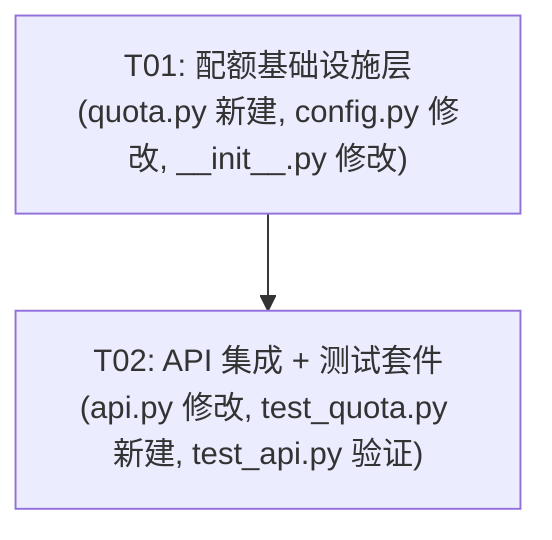

# 阶段二第二片：R12 配额强制（超量 429）—— 系统架构设计与任务分解

> **架构师**：高见远（Bob）｜**项目**：`quota_enforcement_r12`
> **输入 PRD**：`docs/phase2_prd_multitenant_metering.md`（R12: "配额强制：超量拒绝（429）或告警"，P2）
> **前置交付**：阶段二第一片（多租户隔离 + 按量计量）已交付，`metering.py` / `tenant.py` / `api.py` 改造就绪
> **复用资产（不重写）**：`metering.py`（`UsageMeter`、`compute_period_window`）、`tenant.py`（`TenantContext`、`require_tenant`）、`api.py`（`meter_api_call` 依赖链）、`api_auth.py`（`UserInfo`、`require_admin`）
> **严禁触碰**：`mcp_server.py`、`cli.py`、`tools.py`、`pyproject.toml`

---

## Part A: 系统设计

### 1. 实现方案 + 技术选型

#### 1.1 核心设计决策：配额存储方案

| 方案 | 描述 | 评价 |
|------|------|------|
| A — SQLite 表 | 新增 `quota_policies` 表持久化配额 | 过度设计：配额是运营配置，不是计量数据，不需要 CRUD 持久化 |
| **B — 内存级配置（Python dict + env）** ✅ | 线程安全的内存 dict，默认从环境变量读取 | **采用**：零新增依赖、零 schema 管理、运营方通过 env/代码配置即可 |

**理由**：ADL Lite 定位是轻量级能力注册表。配额是运营配置（类似于 `rate_limit`），不是用户数据。配置级方案满足 R12 的全部需求（默认全局 + 租户级覆盖），且与现有 `rate_limit` / `cors_origins` 的配置模式一致。

#### 1.2 依赖注入链设计

**关键约束**：配额检查必须在 `meter_api_call` **之前**执行（先判断是否超量，不超量才记录调用）。

**当前依赖链**（第一片）：
```
require_tenant → meter_api_call → endpoint handler
```

**新增依赖链**（R12）：
```
require_tenant → check_quota → meter_api_call → endpoint handler
```

**实现方式**：修改 `meter_api_call` 的 `Depends` 参数，将 `require_tenant` 替换为 `check_quota`，而 `check_quota` 内部依赖 `require_tenant`：

```python
# api.py — meter_api_call 签名变更（仅一行）
def meter_api_call(
    tenant: TenantContext = Depends(check_quota),  # 原为 Depends(require_tenant)
    request: Request = None,
) -> TenantContext:
```

端点签名**零改动**（`caller: TenantContext = Depends(meter_api_call)` 不变），因为 `check_quota` 返回 `TenantContext`，与 `require_tenant` 同型。

#### 1.3 控制面 vs 数据面判定

| 端点 | 当前依赖 | 是否受配额限制 | 理由 |
|------|----------|:---:|------|
| `POST /mode/dev` | `require_admin` | ❌ | 控制面 admin-only |
| `POST /mode/production` | `require_admin` | ❌ | 控制面 admin-only |
| `GET /mode` | `meter_api_call`（含 `require_tenant`） | ✅ | 数据面（通过 `meter_api_call` 走配额链） |
| 8 个数据面端点 | `meter_api_call` | ✅ | 数据面（通过 `meter_api_call` 走配额链） |
| `GET /tenants/{tid}/usage` | `require_tenant` | ✅ | 需改为 `meter_api_call`（也是 API 调用） |
| `GET /tenants/{tid}/usage/export` | `require_tenant` | ✅ | 需改为 `meter_api_call`（也是 API 调用） |

`/mode/dev` 和 `/mode/production` 本身不走 `meter_api_call`，天然不受配额限制。

#### 1.4 向后兼容保证

- 默认 `max_api_calls=None, max_entities=None` → `check_quota` 快速路径直接返回 → 行为与无配额时完全一致
- `auth_enabled=False` 时 `require_tenant` 返回 `DEFAULT_TENANT` → 配额检查按 `"default"` 租户执行 → 不阻塞请求
- 端点签名不变 → 既有测试继续通过
- `verify_api_key` 签名不变 → `test_api_auth.py` 不受影响

#### 1.5 框架 / 依赖选型

**零新增第三方依赖**：
- `threading.Lock`（标准库）— 配额配置线程安全
- `pydantic.BaseModel`（已有）— `QuotaPolicy` 数据模型
- `fastapi.HTTPException`（已有）— 429 响应
- `datetime`（标准库）— `retry_after` 计算

---

### 2. 文件列表及相对路径

| 文件 | 操作 | 说明 |
|------|------|------|
| `adl_lite/quota.py` | **新建** | `QuotaPolicy`、`QuotaConfig`（线程安全单例）、`check_quota`（FastAPI 依赖）、`configure_quota`（便捷配置函数）、`get_quota_config`（单例访问器） |
| `adl_lite/api.py` | **修改** | `meter_api_call` 依赖链改为 `check_quota`；`get_tenant_usage` / `export_tenant_usage` 改用 `meter_api_call`（纳入配额链）；模块级 `_quota_config` 初始化 |
| `adl_lite/config.py` | **修改** | `get_api_config` 增加 `quota_max_api_calls` / `quota_max_entities` / `quota_period` 读取（env 可选，默认 `None` = 无限制） |
| `adl_lite/__init__.py` | **修改** | 导出 `QuotaPolicy`、`QuotaConfig`、`check_quota`、`configure_quota` |
| `tests/test_quota.py` | **新建** | `QuotaPolicy` / `QuotaConfig` 单元测试；`check_quota` 依赖测试（429 响应格式、默认无限制、租户级覆盖、超量拒绝、控制面不受影响） |

---

### 3. 数据模型与接口（Mermaid classDiagram）

> 完整类图见 `docs/phase2_r12_class-diagram.mermaid`。要点如下：

```
QuotaPolicy (Pydantic BaseModel)
├── max_api_calls: int | None = None    # None = unlimited
├── max_entities: int | None = None     # None = unlimited
└── period: Literal["daily","monthly"] = "monthly"

QuotaConfig (thread-safe singleton)
├── _global: QuotaPolicy
├── _tenants: dict[str, QuotaPolicy]
├── _lock: threading.Lock
├── get_policy(tenant_id) → QuotaPolicy    # 租户覆盖优先，否则全局
├── set_global(policy) → None
├── set_tenant(tenant_id, policy) → None
└── reset() → None                         # 测试用

check_quota (FastAPI Depends)  ← NEW
├── Depends(require_tenant)               # 复用既有租户解析
├── 查 QuotaConfig.get_policy(tenant.id)
├── 若 policy 全 None → 快速返回 tenant
├── 查 UsageMeter.get_record(tenant.id, ...) 
├── 超量 → HTTPException(429)
└── 返回 TenantContext（透传）

meter_api_call (修改)  ← MODIFIED
├── Depends(check_quota)                  # 原为 Depends(require_tenant)
├── record_api_call(tenant.id, endpoint)
└── 返回 TenantContext
```

---

### 4. 程序调用流（Mermaid sequenceDiagram）

> 完整时序图见 `docs/phase2_r12_sequence-diagram.mermaid`。

**核心流程**（以 `POST /register` 为例）：

```
Client → FastAPI Router → require_tenant (JWT/API-key 解析 tenant_id)
  → check_quota:
      1. QuotaConfig.get_policy(tid) → policy
      2. 若 max_api_calls/max_entities 均为 None → 快速通过
      3. UsageMeter.get_record(tid, window) → 当前用量
      4. 若超量 → HTTPException(429, detail={...})
      5. 未超量 → 返回 TenantContext
  → meter_api_call:
      1. UsageMeter.record_api_call(tid, endpoint)
      2. 返回 TenantContext
  → endpoint handler:
      1. _get_engine(tid) → 取租户引擎
      2. 执行业务逻辑
      3. 若 register 成功 → UsageMeter.record_entity(tid)
```

---

### 5. 待明确事项

**无阻断项**。以下为已决议的设计选择：

1. **配额存储**：内存级配置（方案 B），不新增 SQLite 表。遵循 ADL Lite 轻量定位。
2. **`retry_after` 语义**：使用 `period_end`（配额窗口重置时间），例如 `"2026-08-01T00:00:00Z"`，表示该时刻配额重置后可重试。
3. **实体配额检查时机**：统一在 `check_quota` 中检查 `registered_entities` 是否超量（即使对非 register 端点也检查——实现简单且语义一致：配额是租户级上限，跨越所有端点）。
4. **429 响应格式**：使用 FastAPI `HTTPException(429, detail=dict)`，FastAPI 自动序列化为 `{"detail": {...}}`。内部 `detail` 包含 `error`、`detail`（人类可读描述）、`quota`（配额上限）、`current`（当前用量）、`retry_after`（ISO 8601 重置时间）。

---

## Part B: 任务分解

### 6. 依赖包清单

```
# 本期零新增第三方依赖
# - threading     （Python 标准库）—— QuotaConfig 线程安全
# - pydantic>=2.0 （已存在）       —— QuotaPolicy 模型
# - fastapi        （已存在）       —— HTTPException + Depends
# - datetime       （标准库）       —— retry_after 计算
```

`pyproject.toml` **无需改动**。

---

### 7. 任务列表（有序，含依赖）

#### T01 — 配额基础设施层　[QuotaPolicy + QuotaConfig + 配置入口]

- **优先级**：P0
- **文件**：
  - `adl_lite/quota.py` — **新建**：`QuotaPolicy(BaseModel)`、`QuotaConfig`（线程安全单例）、`check_quota`（FastAPI `Depends`）、`configure_quota`（便捷函数）、`get_quota_config`（单例访问器）
  - `adl_lite/config.py` — **修改**：`get_api_config` 增加 `quota_max_api_calls`（`QUOTA_MAX_API_CALLS` env）、`quota_max_entities`（`QUOTA_MAX_ENTITIES` env）、`quota_period`（`QUOTA_PERIOD` env，默认 `"monthly"`）读取
  - `adl_lite/__init__.py` — **修改**：导出 `QuotaPolicy`、`QuotaConfig`、`check_quota`、`configure_quota`、`get_quota_config`
- **改动要点**：
  1. `QuotaPolicy`：Pydantic 模型，`max_api_calls: int | None = None`（`None` = 无限制）、`max_entities: int | None = None`、`period: Literal["daily", "monthly"] = "monthly"`
  2. `QuotaConfig`：线程安全内存配置，`_global: QuotaPolicy` + `_tenants: dict[str, QuotaPolicy]` + `threading.Lock`；`get_policy(tenant_id)` 租户覆盖优先，无覆盖回退全局；`set_global` / `set_tenant` / `reset` 方法
  3. `check_quota(tenant: TenantContext = Depends(require_tenant)) -> TenantContext`：FastAPI 依赖，查 `QuotaConfig.get_policy(tenant.id)` → 若全 `None` 快速返回 → 否则查 `UsageMeter.get_record(...)` → 超量抛 `HTTPException(429, detail=dict)`；**快速路径**：`max_api_calls is None and max_entities is None` 时跳过所有计量查询
  4. `configure_quota(tenant_id=None, max_api_calls=None, max_entities=None, period="monthly")`：便捷函数，`tenant_id=None` 设全局，否则设租户级覆盖
  5. `config.py`：环境变量 `QUOTA_MAX_API_CALLS`、`QUOTA_MAX_ENTITIES`、`QUOTA_PERIOD`，全可选，默认不设（= 无限制）
- **依赖前置**：无
- **验收要点**：
  - `QuotaPolicy.model_validate(...)` 正确解析
  - `QuotaConfig.get_policy("acme")` 无覆盖时返回全局策略
  - `QuotaConfig.set_tenant("acme", ...)` 后 `get_policy("acme")` 返回租户策略
  - `check_quota` 在默认 `None/None` 下不抛异常，快速返回
  - `check_quota` 在 `max_api_calls=0, current=0` 时抛 429（边界：等于上限即拒绝）

#### T02 — API 集成 + 测试套件　[依赖链改造 + 429 验证 + 回归]

- **优先级**：P0
- **文件**：
  - `adl_lite/api.py` — **修改**：`meter_api_call` 依赖链 `require_tenant` → `check_quota`；`get_tenant_usage` / `export_tenant_usage` 改用 `meter_api_call`；`create_app` 中初始化 `QuotaConfig` 全局策略（从 env 读取）；模块级 `_quota_config` 变量（供测试重置）
  - `tests/test_quota.py` — **新建**：`QuotaPolicy` / `QuotaConfig` 单元测试；`check_quota` 依赖测试（默认无限制 200、超量 429 格式验证、租户级覆盖、控制面不受影响、`retry_after` 正确）
  - `tests/test_api.py` — **验证**：运行全量确认零回归（auth 关闭路径、既有端点行为）
- **改动要点**：
  1. `api.py:meter_api_call`：`tenant: TenantContext = Depends(require_tenant)` → `tenant: TenantContext = Depends(check_quota)`（**一行变更**）
  2. `api.py:get_tenant_usage`：`caller: TenantContext = Depends(require_tenant)` → `caller: TenantContext = Depends(meter_api_call)`（纳入配额+计量链）
  3. `api.py:export_tenant_usage`：同上
  4. `api.py:create_app`：读取 `_config["quota_max_api_calls"]` / `_config["quota_max_entities"]` / `_config["quota_period"]`，设置 `QuotaConfig` 全局策略
  5. 模块级 `_quota_config` 变量 + 重置逻辑（`create_app` 调用时重建，与 `_meter` 模式一致）
  6. `test_quota.py`：覆盖——
     - 默认无限制 → 请求正常 200
     - 设 `max_api_calls=5`，第 6 次请求 → 429
     - 429 响应体含 `error`、`detail`、`quota`、`current`、`retry_after`
     - 租户 A 超量不影响租户 B
     - `POST /mode/dev` 超配额后仍 200（控制面免检）
     - `retry_after` 为 `period_end` ISO 8601 时间戳
- **依赖前置**：T01
- **验收要点**：
  - `pytest tests/test_api.py tests/test_api_auth.py tests/test_quota.py -x` 全绿
  - 配额 = 默认无限制时所有端点行为不变（1492 passed 基线保持）
  - 配额超量后 429 返回格式正确
  - `check_quota` 在 `meter_api_call` 之前执行（通过日志/调用顺序验证）

---

### 8. 共享知识（跨文件约定）

1. **`QuotaPolicy.max_* = None` 语义**：`None` 表示无限制，不是 0。`check_quota` 中 `max_api_calls is None` 时跳过该维度检查。`0` 表示「不允许任何调用」（立即拒绝），是有意支持的行为。
2. **配额检查顺序**：`require_tenant` → `check_quota` → `meter_api_call`。`check_quota` 在 `meter_api_call` 之前确保「先判断是否超量，不超量才记录调用」——不会出现「第 10001 次调用被记录后才发现超量」的 off-by-one 问题。**严格 `>=`（当前用量 ≥ 上限即拒绝）**。
3. **配额周期与计量周期对齐**：`check_quota` 使用与 `UsageMeter` 相同的 `compute_period_window(now, policy.period)`，确保配额窗口与计量窗口一致。
4. **429 响应体结构**：
   ```json
   {
     "detail": {
       "error": "quota_exceeded",
       "detail": "Quota exceeded: api_calls (current: 10001, max: 10000)",
       "quota": {"max_api_calls": 10000, "max_entities": null},
       "current": {"api_calls": 10001, "registered_entities": 5},
       "retry_after": "2026-08-01T00:00:00Z"
     }
   }
   ```
   FastAPI 自动包装 `detail` 为顶层 key，内层 `detail` 为人类可读描述。
5. **`check_quota` 快速路径**：当 `QuotaPolicy.max_api_calls is None and QuotaPolicy.max_entities is None` 时，跳过 `UsageMeter.get_record()` 查询（避免无配额场景下的不必要 SQLite 查询），直接返回 `TenantContext`。
6. **`configure_quota` 便捷函数**：
   ```python
   # 设全局配额（所有租户）
   configure_quota(max_api_calls=10000, period="monthly")
   # 设租户级覆盖
   configure_quota(tenant_id="acme", max_api_calls=50000)
   # 重置（测试用）
   get_quota_config().reset()
   ```
7. **环境变量命名**：`QUOTA_MAX_API_CALLS`、`QUOTA_MAX_ENTITIES`、`QUOTA_PERIOD`（全可选，不设 = 无限制）。
8. **控制面判定规则**：使用 `require_admin`（而非 `require_tenant` / `meter_api_call`）的端点为控制面，不受配额限制。当前仅 `POST /mode/dev` 和 `POST /mode/production` 两个端点满足此条件。
9. **`_quota_config` 生命周期**：与 `_meter` 一致——`create_app` 调用时重新初始化，模块级导入时创建默认实例（`QuotaPolicy()` = 全无限制）。

---

### 9. 任务依赖图



> 仅 2 个任务。T01 为基础设施（QuotaPolicy、QuotaConfig、check_quota），T02 为集成与验证（api.py 依赖链改造 + 测试覆盖）。两个任务均 ≥ 3 个文件，符合硬约束。
