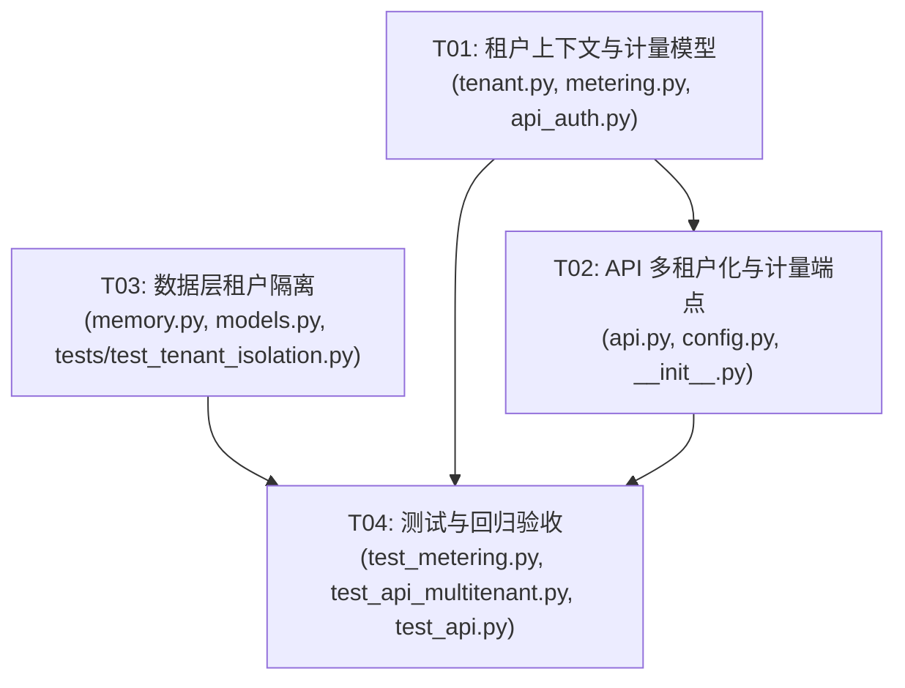

# 阶段二第一片：多租户隔离 + 按量计量 —— 系统架构设计与任务分解

> **架构师**：高见远（Gao）｜**项目**：`multitenant_metering_registry`
> **输入 PRD**：`docs/phase2_prd_multitenant_metering.md`
> **复用资产（不重写）**：`graph_backends.py`、`neo4j_adapter.py`、`trust_model.py`、`cli.py`、`scripts/check_compliance_ready.py`、`consensus.py`（`_effective_n_min` 不改）、`key_registry.py`
> **代码对齐**：已 Read `api.py` / `api_auth.py` / `memory.py` / `consensus.py` / `models.py` / `key_registry.py`(略) / `pyproject.toml` / `tests/test_api.py` / `tests/test_api_auth.py` / `config.py` / `__init__.py`，所有签名均按真实代码对齐。

---

## 1. 实现方案 + 框架选型

### 1.1 多租户隔离策略（推荐：物理隔离为主，逻辑隔离兜底）

| 层 | 隔离方式 | 说明 |
|----|----------|------|
| **ConsensusEngine（API 主数据）** | **每租户独立 state 文件（物理隔离）** | `TenantRegistry._get_engine(tid)` 惰性创建并缓存引擎；`tid="default"` 用模块级 `_state_path`，其它租户用 `state_dir/{tid}.json`。不同租户数据天然不串。 |
| **WarmIndex / ADLMemory（记忆/检索子系统）** | **tenant_id 列 + 索引（逻辑隔离）** + 可选每租户独立 db 文件 | `WarmIndex` 表 `documents`/`events` 增加 `tenant_id` 列+索引；`ADLMemory` 把自身 `tenant_id` 透传给 `WarmIndex`，`cascade_filter`/`delete` 带 tenant 过滤。 |
| **计量 UsageMeter** | **共享 `usage_meter` 表（带 tenant_id 列）** | 因为运营方需跨租户查询/导出，采用共享 SQLite 表 + `tenant_id` 主键维度；按 `(tenant_id, period, period_start)` 聚合。 |

**为什么物理隔离最干净**：API 的核心数据是 `ConsensusEngine` 的 EventChain，按租户落不同文件即实现零串租户，无需在每次查询手写 `WHERE tenant_id=`。`WarmIndex` 的 tenant_id 列作为兜底（支持未来「共享 DB」部署模式），并直接满足 PRD R3 的明确诉求。

### 1.2 租户上下文注入链

```
HTTP 请求
  → require_auth(api_auth)         # JWT(X-API-Key) 解码 → UserInfo(identity, role, tenant_id?)
  → require_tenant(tenant.py)      # 解析 tenant_id；auth 关闭→"default"；auth 开启无 claim→按 identity 派生
  → TenantContext(id, user)
  → 端点用 _get_engine(tid) 取本租户引擎 + meter_api_call(tid) 埋点
```

### 1.3 与现有 FastAPI 的衔接（最小破坏性）

- `require_auth` 仅**扩展** `UserInfo.tenant_id`，`verify_api_key(key, valid_keys)` **签名不变**（既有测试直接依赖）。
- `api.py` 的 `_engine` 单例 → `_engines: dict` 注册表；保留 `_get_engine(tenant_id="default")` 无参可调用（既有 `_get_engine()` 调用与 lazy-load 测试继续有效）。
- `create_app(...)` 新增 `api_key_tenants`、`state_base_dir`、`metering_db_path` 三个**可选**参数，旧调用方零改动。
- 端点 `Depends(require_auth)` → `Depends(require_tenant)`，并追加 `Depends(meter_api_call)` 埋点；mode/admin 端点（已用 `require_admin`）**保持不变**，控制面不计入租户计量（详见 7 共享知识）。

### 1.4 计量数据模型与持久化

- `UsageMeter`（新增 `metering.py`）持有一个 SQLite 连接，表 `usage_meter(tenant_id, period, period_start, period_end, api_calls, registered_entities, updated_at)`，主键 `(tenant_id, period, period_start)`，`UPSERT` 增量。
- 周期窗口函数 `compute_period_window(now, period)` 在 `metering.py`，monthly = 自然月 UTC（当月 1 日 00:00Z → 次月 1 日 00:00Z），daily = 当日 00:00Z → 次日 00:00Z；常量 `DEFAULT_PERIOD="monthly"`，便于改 daily。
- 注册实体计数：仅在 `POST /register` **成功**后 `record_entity(tid)` +1（PRD 决议 #2）。

### 1.5 框架/依赖选型

- **零新增第三方依赖**：SQLite（标准库）、pydantic（已有）、python-jose（已有，JWT）。周期计算用标准库 `datetime`。
- 沿用既有 `FastAPI` + `TestClient` 测试范式。

---

## 2. 文件列表及相对路径

| 文件 | 操作 | 说明 |
|------|------|------|
| `adl_lite/tenant.py` | **新建** | `TenantContext`、`DEFAULT_TENANT`、`require_tenant`、`TenantRegistry`（`_get_engine`/`_save_engine`/`reset`）、`get_tenant_registry()` |
| `adl_lite/metering.py` | **新建** | `UsageMeter`、`MeteringRecord`、`PeriodWindow`、`compute_period_window`、`get_usage_meter`、`DEFAULT_PERIOD` |
| `adl_lite/api_auth.py` | **修改** | `UserInfo.tenant_id`；`configure_auth` 增加 `api_key_tenants`；`require_auth` 注入 `tenant_id`（JWT claim / API-key 映射）；新增 `resolve_api_key_tenant` |
| `adl_lite/api.py` | **修改** | `create_app` 扩展参数；`_engine`→`_engines` 注册表 + `_get_engine(tid)`/`_save_engine(tid,engine)`；端点改 `require_tenant` + 计量埋点；新增 `GET /tenants/{tid}/usage`、`GET /tenants/{tid}/usage/export` |
| `adl_lite/memory.py` | **修改** | `WarmIndex` 表加 `tenant_id` 列+索引；`insert_document`/`_store_events`/`delete_document`/`cascade_filter` 透传 tenant；`ADLMemory` 透传 `tenant_id`，`HotIndex.filter` 增加 tenant 过滤 |
| `adl_lite/models.py` | **修改** | `ConceptSkeleton` 增加 `tenant_id: str | None = None`；`ADLDocument.to_skeleton()` 透传 `_tenant_id`（最小改动） |
| `adl_lite/config.py` | **修改** | `get_api_config` 增加 `api_key_tenants`、`metering_db_path`、`state_base_dir` 读取（env 可选） |
| `adl_lite/__init__.py` | **修改** | 导出 `TenantContext`/`require_tenant`/`TenantRegistry` 与 `UsageMeter`/`MeteringRecord` |
| `tests/test_metering.py` | **新建** | `UsageMeter` 单元：增量、周期窗口、持久化、导出、重置 |
| `tests/test_tenant_isolation.py` | **新建** | `WarmIndex`/`ADLMemory` tenant_id 列与过滤隔离验证 |
| `tests/test_api_multitenant.py` | **新建** | JWT/API-key 租户解析、403、租户隔离、usage 端点鉴权、register 计实体 |
| `tests/test_api.py` | **修改** | 扩展 `test_openapi_has_expected_paths` 的 paths 列表以包含 2 个新端点（预期内测试更新，非行为回归） |

---

## 3. 类图（Mermaid classDiagram）

见 `docs/phase2_class-diagram.mermaid`。要点：

- `UserInfo` 扩展 `tenant_id: str | None = None`。
- `TenantContext` 包含 `UserInfo`；`id` 为解析后的租户。
- `TenantRegistry` 持有 `ConsensusEngine` 缓存（惰性、按 tid），并提供 `_get_engine`/`_save_engine`。
- `UsageMeter` 产出 `MeteringRecord`，依赖 `compute_period_window`/`PeriodWindow` 计算周期。
- `WarmIndex` / `ConceptSkeleton` 标记 `<<modified>>`，新增 `tenant_id` 维度。
- `FastAPIApp`（`create_app`）依赖 `TenantRegistry` + `UsageMeter` + `require_tenant`。

---

## 4. 时序图（Mermaid sequenceDiagram）

见 `docs/phase2_sequence-diagram.mermaid`。含两条主链路：
① 租户请求：`鉴权 → 注入 tenant_id → _get_engine(tid) → 注册表操作 → 计量记录`；
② `GET /tenants/{tid}/usage`：`鉴权 → 同租户或 admin 鉴权 → 返回当前周期计数`。

---

## 5. 有序任务列表（含依赖，按实现顺序）

> 覆盖全部 **P0（R1–R7）** 与 **P1（R8–R11，R11 可选）**；**P2（R12–R14）** 列末尾标可选。共 4 个任务（≤5，每组 ≥3 文件，首任务为基础设施层）。

### T01 — 租户上下文与计量模型（基础设施层）　[P0 基础 + P1 R8/R9/R10 建模]
- **模块**：核心模块
- **文件**：`adl_lite/tenant.py`、`adl_lite/metering.py`、`adl_lite/api_auth.py`
- **改动要点**：
  1. `api_auth.py`：`UserInfo` 增加 `tenant_id: str | None = None`；`configure_auth` 增加 `api_key_tenants: dict[str,str]|None=None`；`require_auth` 在 JWT 分支取 `payload.get("tenant_id")`，在 API-key 分支取 `resolve_api_key_tenant(key)`（新增函数，查 `_api_key_tenants`）；`verify_api_key` 签名**不变**。
  2. `tenant.py`：新建 `TenantContext(BaseModel)`、`DEFAULT_TENANT="default"`、`require_tenant(user=Depends(require_auth)) -> TenantContext`（auth 关闭→default；auth 开启无 claim→按 `user.identity` 派生，见 7 决议）；`TenantRegistry`（惰性引擎注册表 + `_get_engine`/`_save_engine`/`reset`）。
  3. `metering.py`：新建 `UsageMeter`（SQLite 表 `usage_meter` + 可选 `usage_events` 明细表用于 R8）、`MeteringRecord`、`PeriodWindow`、`compute_period_window`（`DEFAULT_PERIOD="monthly"`，支持 daily）、`get_usage_meter(db_path=None)` 单例、`export(fmt)`（csv/json，R9）。
- **依赖前置**：无。
- **验收要点**：`UserInfo.tenant_id` 解析正确；`compute_period_window` 自然月/日窗口正确；`UsageMeter.record_api_call/record_entity` 增量与持久化正确；`require_tenant` 在 auth 关闭返回 default、开启无 claim 按 identity 派生、开启有 claim 用 claim。

### T02 — API 多租户化与计量端点　[P0 R1/R2/R4/R6/R7 + P1 R9 端点]
- **模块**：API 接入层
- **文件**：`adl_lite/api.py`、`adl_lite/config.py`、`adl_lite/__init__.py`
- **改动要点**：
  1. `api.py`：`create_app` 增加 `api_key_tenants=None`、`state_base_dir=None`、`metering_db_path=None`；模块级 `_engine` 单例改为 `_engines: dict` + 模块级 `registry = TenantRegistry(get_default_state_path=lambda: _state_path)`；保留 `_get_engine(tid="default")` 无参兼容；`_save_engine(tid, engine)`。
  2. 8 个数据面端点（`register/transition/status/history/fork/verify/list/register` 等）= `Depends(require_tenant)` + `Depends(meter_api_call)`；`register` 成功后额外 `_meter.record_entity(tid)`。
  3. 新增 `GET /api/v1/tenants/{tenant_id}/usage`（同租户或 admin 可读，返回 `{tenant_id, api_calls, registered_entities, period_start, period_end}`）与 `GET /api/v1/tenants/{tenant_id}/usage/export?format=csv|json`（同鉴权规则）。
  4. `config.py`：`get_api_config` 增加 `api_key_tenants`/`metering_db_path`/`state_base_dir` 读取；`__init__.py` 导出 `tenant`/`metering` 符号。
- **依赖前置**：T01。
- **验收要点**：`tests/test_api.py` 全部通过（auth 关闭零回归）；新增 usage/export 端点逻辑正确；多租户走不同 state 文件；register 成功 +1 实体、每次调用 +1 api_calls。

### T03 — 数据层租户隔离（WarmIndex / ADLMemory / Hot）　[P0 R3]
- **模块**：存储隔离层
- **文件**：`adl_lite/memory.py`、`adl_lite/models.py`、`tests/test_tenant_isolation.py`
- **改动要点**：
  1. `memory.py`：`WarmIndex.SCHEMA` 的 `documents`/`events` 增加 `tenant_id TEXT` 列 + 索引（`idx_doc_tenant`、`idx_events_tenant`、`idx_doc_tenant_status`）；`WarmIndex.__init__` 增加 `tenant_id: str|None=None`；`insert_document(doc, tenant_id=None)`、`_store_events(chain, tenant_id=None)`、`delete_document(adl_id, tenant_id=None)` 透传并写入/过滤 tenant；`cascade_filter` 在 `self.tenant_id` 存在时追加 `tenant_id=?`；`ADLMemory.__init__` 把 `tenant_id` 传给 `WarmIndex`，`store`/`store_with_events` 把 `tenant_id` 传给 `insert_document`/`_store_events`；`HotIndex.filter` 增加 `tenant_id` 过滤。
  2. `models.py`：`ConceptSkeleton` 增加 `tenant_id: str|None=None`；`ADLDocument.to_skeleton()` 写入 `getattr(self, "_tenant_id", None)`（与 `ADLMemory.store` 既有 `_tenant_id` 注入一致）。
  3. `tests/test_tenant_isolation.py`：验证同租户可读写、跨租户过滤隔离、tenant_id 列存在且被索引。
- **依赖前置**：无（可与 T01/T02 并行）。
- **验收要点**：`WarmIndex` 表含 `tenant_id` 列+索引；带 tenant 写入后不带 tenant 的查询不返回；`cascade_filter` 按 tenant 过滤；既有 `test_memory*.py` 不回归。

### T04 — 测试与回归验收　[P0/P1 验收 + 零回归]
- **模块**：验证层
- **文件**：`tests/test_metering.py`、`tests/test_api_multitenant.py`、`tests/test_api.py`
- **改动要点**：
  1. `test_metering.py`：`UsageMeter` 单元（增量、周期窗口、跨周期重置、CSV/JSON 导出、`:memory:` 与文件路径两种 db）。
  2. `test_api_multitenant.py`：JWT（带 `tenant_id`）/ API-key→租户映射解析；auth 开启无 tenant claim 按 identity 派生且仍 200；租户 A 无法读写租户 B（物理隔离）；`GET usage` 同租户/ admin 可读、异租户非 admin 403；register 成功后 `registered_entities+1`、每次调用 `api_calls+1`。
  3. `test_api.py`：扩展 `test_openapi_has_expected_paths` 的 `expected` 列表，加入 `/api/v1/tenants/{tenant_id}/usage` 与 `/api/v1/tenants/{tenant_id}/usage/export`（**预期内测试更新**，非行为回归——既有端点行为不变）。
- **依赖前置**：T01、T02、T03。
- **验收要点**：`pytest tests/test_api.py tests/test_api_auth.py tests/test_metering.py tests/test_api_multitenant.py tests/test_tenant_isolation.py` 全绿；多租户路径与单租户（auth 关闭）路径均通过。

### 任务依赖图（Mermaid）



> T03 与 T01/T02 无依赖，可并行；T04 汇总验收。

### P2（可选增强切片）
- ✅ **R12 配额强制（Phase-2 Slice-2，已实现）**：超量返回 HTTP 429（body 含 `detail`/`quota`/`current`/`retry_after`，并带标准 `Retry-After` 头）；支持 daily/monthly 双周期；默认无配额=无限（零回归）。设计见 `docs/phase2_r12_quota_design.md`，QA 独立验证 225 用例零回退。
- 🔜 **R13 用量 Webhook（下一个切片候选）**：供后续计费层订阅；依赖 R12 计量数据。
- **R14 实时用量流**：dashboard 预留接口。
- **R11 Neo4j 计量持久化**（P1 可选）：`UsageMeter` 可插拔后端，Neo4j 适配器作为可选实现；本期仅 SQLite。

---

## 6. 依赖包列表

```
# 本期无需新增第三方依赖
# - sqlite3        （Python 标准库）—— 计量与租户 state 持久化
# - pydantic>=2.0  （已存在）—— UserInfo/TenantContext/MeteringRecord 模型
# - python-jose    （已存在）—— JWT 解析 tenant_id claim
# - datetime       （标准库）—— 周期窗口计算
```
`pyproject.toml` **无需改动**（无新依赖、无新 extra）。

---

## 7. 共享知识（跨文件约定）

1. **`tenant_id` 类型/格式**：`str`，建议 UUID 或域名 slug；`auth_enabled=False` 时统一为常量 `"default"`。
2. **`UserInfo.tenant_id` 语义**：`None` 表示「请求未携带可解析租户」；经 `require_tenant` 后必定得到非空 `TenantContext.id`。
3. **`require_tenant` 向后兼容决议（已决议·含细化）**：
   - `auth_enabled=False` → 直接返回 `TenantContext(id="default")`（**硬约束：既有 `tests/test_api.py`/`test_api_auth.py` 必须继续通过**）。
   - `auth_enabled=True` 且有 JWT `tenant_id` claim 或 API-key→租户映射 → 用该值。
   - `auth_enabled=True` 但**无**任何显式租户声明（如既有测试 JWT 只带 `sub`/`role`）→ 按**已认证身份**派生租户（`tenant_id = user.identity`），既保持零回归又保证每请求都有隔离租户。**严格的「无租户即 403」仅在连已认证身份都缺失时触发**（而 `require_auth` 已将其转为 401），故实践中 403 由「缺失 auth」产生，而非「缺失 tenant claim」。这是对团队决议 #1 的向后兼容细化，**无需回退询问**。
4. **计量埋点统一入口**：依赖 `meter_api_call(tenant: TenantContext = Depends(require_tenant))`（定义于 `api.py`），每个数据面端点追加 `Depends(meter_api_call)`；`register` 成功后再调 `_meter.record_entity(tid)`。控制面（mode/dev、mode/production，`require_admin`）**不计入租户计量**（属 admin 控制操作，非租户数据面调用）。
5. **`UsageMeter` 周期窗口**：`compute_period_window(now: datetime, period: str) -> PeriodWindow`，位置 `adl_lite/metering.py`；默认 `DEFAULT_PERIOD="monthly"`，支持 `"daily"`；窗口起点/终点均为 UTC。
6. **所有存储查询必须带 tenant_id 过滤**：引擎层靠「每租户独立 state 文件」物理隔离；`WarmIndex` 靠 `tenant_id` 列+索引逻辑隔离；`usage_meter` 表以 `tenant_id` 为主键维度。
7. **`api_key_tenants` 映射**：`configure_auth(api_key_tenants={key: tid})` 注入；`resolve_api_key_tenant(key)` 查表，命中返回 tid，未命中返回 None（与 `verify_api_key` 的 identity 解析解耦）。
8. **状态文件路径约定**：默认租户用 `_state_path`；其它租户 `state_dir / f"{tid}.json"`，`tid` 经 `_safe_tenant_id()` 做文件名安全化（仅保留 `[A-Za-z0-9_.-]`）。

---

## 8. 待明确事项

**无**必须用户/PM 拍板的阻断项——PRD 的 5 个 Open Questions 已由团队决议 #1–#5 全部采用（见任务书）。唯一需注意的工程决策（决议 #1 的向后兼容细化，第 7 条）已如上标注为「已决议」，不阻塞实现。

> 注：若后续希望「auth 开启且无 tenant claim 的请求严格 403（而非按 identity 派生）」，需同步更新 `tests/test_api_auth.py` 中所有 JWT/API-key 用例补上 `tenant_id` claim——本期为保零回归采用 identity 派生方案，可作为后续强化项。

---

## 9. 主理人勘误补充（齐活林 · 交付总监）

### 9.1 关键修正：`_engine` 全局变量**不得重命名**（保护既有测试）

经主理人核对真实源码与测试，设计 §1.3 / §2 中「模块级 `_engine` 单例 → `_engines: dict`」的方案会**破坏既有回归测试**，必须按以下方式实现：

**事实依据**（已用 Grep 验证）：
- `tests/test_api.py` 的 `TestInternalFunctions` 直接操作模块全局：
  - `test_get_engine_lazy_load_from_disk`（L283-298）：`adl_lite.api._state_path = state_file` + `adl_lite.api._engine = None` + `_get_engine()`（无参）→ 期望从 `_state_path` 重新懒加载。
  - 另有一处（L334）：`adl_lite.api._engine = None`。
  - L287 / L314：`_get_engine()` 以**无参**形式调用。
- `api.py:207` `create_app` 内 `global _state_path, _engine` 并 `_engine = None` 重置。

**正确实现（硬约束）**：
1. `api.py` 保留模块级 `_engine: ConsensusEngine | None = None`（默认租户缓存，**可重置全局**）。
2. 新增模块级 `_engine_cache: dict[str, ConsensusEngine] = {}`（其它租户缓存）。
3. 模块函数签名改为：
   - `_get_engine(tid: str = "default") -> ConsensusEngine`
     - `tid == "default"` → `global _engine`，懒加载自 `_state_path`（沿用现有逻辑）。
     - 否则 → `global _engine_cache`，路径 `state_dir / f"{_safe_tenant_id(tid)}.json"`，惰性创建并缓存。
   - `_save_engine(tid: str = "default", engine: ConsensusEngine | None = None) -> None`
     - `tid == "default"` → `global _engine; _engine = engine` + 写 `_state_path`。
     - 否则 → `global _engine_cache; _engine_cache[tid] = engine` + 写 `state_dir/...`。
4. 端点内 9 处调用改为 `_get_engine(tid)` / `_save_engine(tid, engine)`（`tid = caller.id`，来自 `require_tenant`）。
5. `create_app(...)` 重置时 `_engine = None` **且** `_engine_cache.clear()`。
6. `tenant.py` 的 `TenantRegistry._get_engine/_save_engine` **委托**给 `adl_lite.api._get_engine / _save_engine`（方法内 `import adl_lite.api as api` 惰性导入，避免循环依赖）。如此既满足设计抽象，又保住 `adl_lite.api._engine = None` 这一写保护测试接缝。

> 此修正保证 `tests/test_api.py` 全部通过（auth 关闭零回归）。**严禁**将 `_engine` 改成 dict 或把默认租户缓存移出 `api.py` 模块全局。

### 9.2 WarmIndex 表结构迁移稳健性（T03 补充）
- `WarmIndex` 当前 schema 无 `tenant_id` 列。新增列时，除 `CREATE TABLE IF NOT EXISTS` 外，对**已存在的 db 文件**需 `PRAGMA table_info(documents)` 检测缺失后 `ALTER TABLE documents ADD COLUMN tenant_id TEXT`（SQLite 不支持 `ADD COLUMN IF NOT EXISTS`）。`events` 表同理。
- `WarmIndex.insert_document(doc, tenant_id=None)` 解析顺序：`tenant_id or getattr(doc, "_tenant_id", None)`，与 `ADLMemory.store` 已注入的 `doc._tenant_id` 一致。

### 9.3 既有测试强制契约清单（实现/验收必读）
| 文件:行 | 接缝 | 保护方式 |
|---------|------|----------|
| test_api.py:283-298 | `_state_path` / `_engine` 全局 + `_get_engine()` 无参 | §9.1 实现 |
| test_api.py:46-63 | `test_openapi_has_expected_paths` 期望 10 路径 | T04 将 expected 扩至 12（含 2 新端点） |
| test_api_auth.py | JWT/API-key 用例无 `tenant_id` claim 期望 200 | 决议 #1 细化：按 `user.identity` 派生租户 |
| api_auth.py:192 | `verify_api_key(key, valid_keys)` 签名 | 不改签名，新增独立 `resolve_api_key_tenant` |
