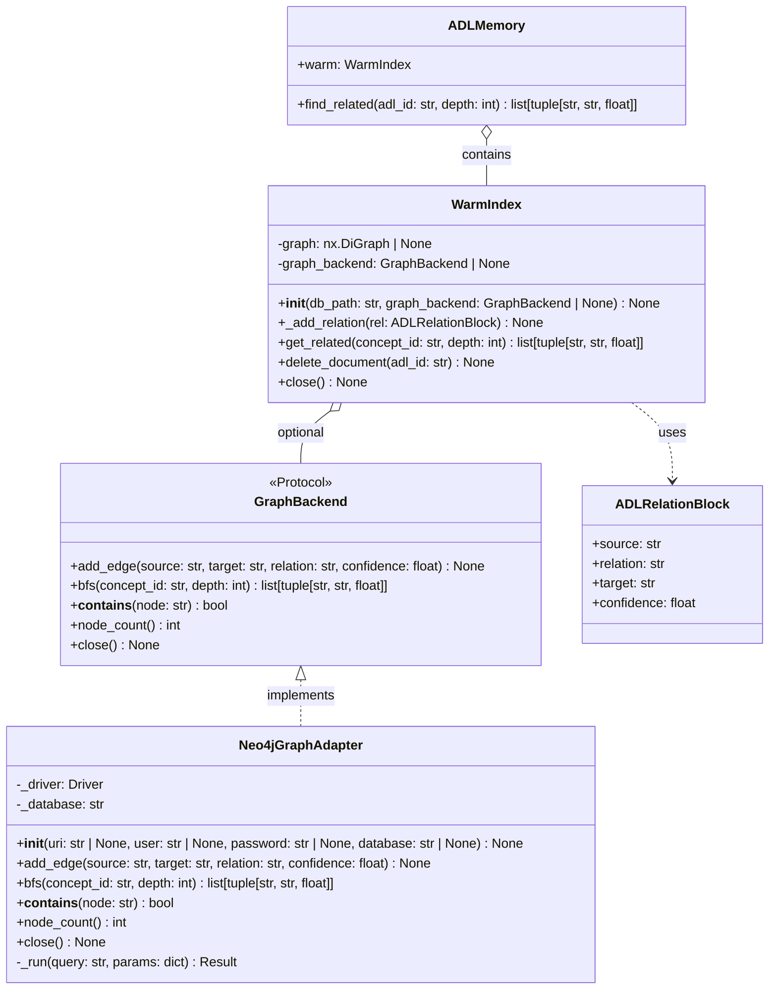
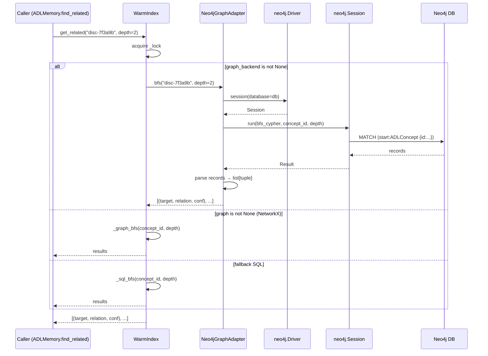
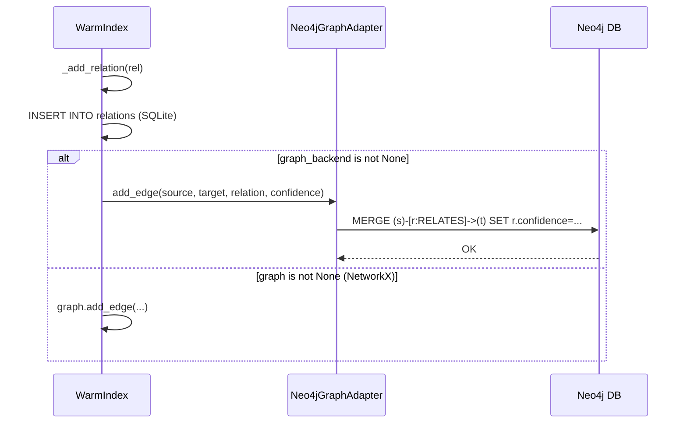
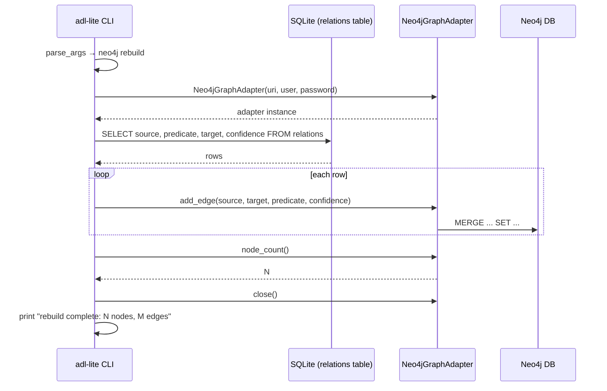
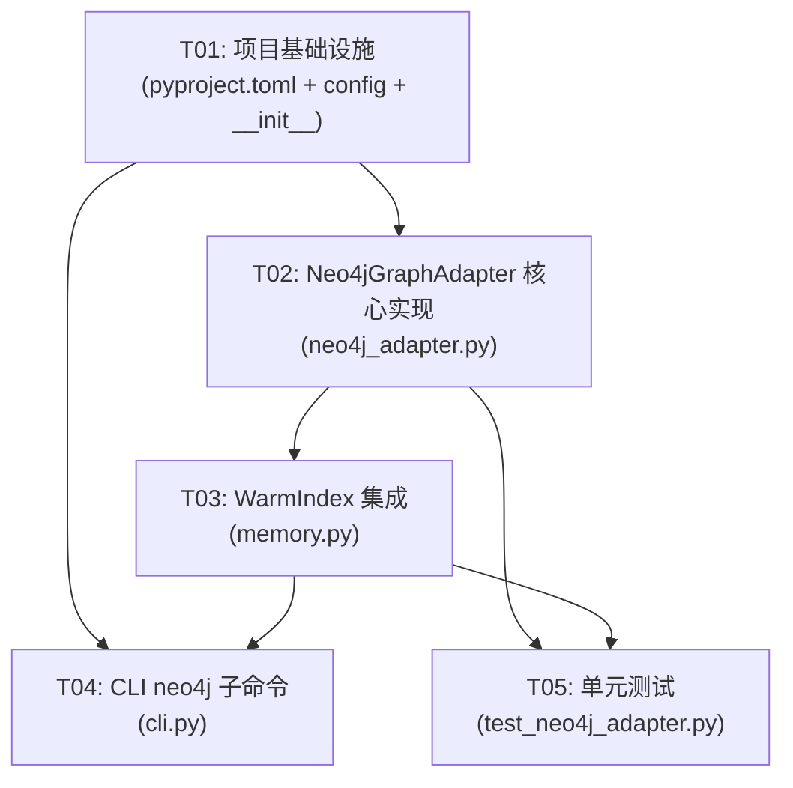

# F25 Neo4j Adapter Layer — System Design & Task Decomposition

> **ADL Lite v0.6.0-alpha** · Architect: 高见远 (Bob)
> 
> Date: 2025-07-17

---

## Part A: System Design

---

### 1. Implementation Approach

#### 核心技术难点

| 难点 | 分析 | 解决方案 |
|------|------|----------|
| **NetworkX 替换为 Neo4j 的侵入面控制** | `WarmIndex` 内 `self.graph: nx.DiGraph | None` 在 `_add_relation`、`get_related`、`_graph_bfs`、`delete_document` 四处被引用，需最小化改动 | 引入 `GraphProtocol` / `GraphBackend` 抽象接口，`Neo4jGraphAdapter` 实现该接口，`WarmIndex.__init__` 通过 `graph_backend` 参数注入 |
| **同步 vs 异步** | `neo4j` Python driver v5 同时支持同步（`session.run()`）和异步 API；现有 `WarmIndex` 全部为同步调用 | 使用同步 API（`GraphDatabase.driver`），零侵入现有调用链 |
| **Cypher BFS 语义对齐** | NetworkX `_graph_bfs` 只走**出边**（`successors`），而 SQL `_sql_bfs` 走双向（`UNION`）。Neo4j 适配器替换的是 NetworkX 路径 | Cypher 查询使用定向边模式 `(start)-[*1..depth]->(other)` 对齐 `successors` |
| **连接生命周期** | Neo4j driver 是长连接资源，需在 `WarmIndex.close()` 时清理 | `Neo4jGraphAdapter.close()` 代理到 `driver.close()`，在 `WarmIndex.close()` 中调用 |
| **重建（rebuild）** | 从 SQLite `relations` 表全量重建到 Neo4j，需处理已有数据冲突（幂等） | 使用 `MERGE` 代替 `CREATE`，按 `(source, predicate, target)` 唯一约束 upsert |

#### 框架与库选型

| 组件 | 选择 | 理由 |
|------|------|------|
| Neo4j Driver | `neo4j>=5.0` | 稳定、广泛使用，支持同步 API，与现有同步栈兼容 |
| 测试 Mock | `unittest.mock` (stdlib) + pytest | 无额外依赖；mock `neo4j.Driver` / `Session` / `Result` |
| 环境变量 | `os.environ` + `pydantic-settings` (已存在) | 项目已有 `pydantic-settings` 依赖，可复用 |

#### 架构模式

**Strategy Pattern** — `WarmIndex` 持有 `GraphBackend` 协议引用，运行时可切换 NetworkX（默认）或 Neo4j：

```
WarmIndex
├── graph: nx.DiGraph | None          ← 默认（networkx）
└── graph_backend: GraphBackend | None ← 可选（neo4j）
```

两套互斥：当 `graph_backend` 非 None 时，`self.graph` 置为 None。

---

### 2. Open Questions — Decisions

| # | 问题 | 决策 |
|---|------|------|
| 1 | Neo4j driver 版本锁定 | **`neo4j>=5.0`** — 稳定 API，广泛部署 |
| 2 | 认证方式 | **环境变量 + 构造函数参数**（构造参数优先于环境变量） |
| 3 | `__contains__` 缓存 | **跳过 MVP** — Neo4j 内部已有节点缓存，每次查询代价低 |
| 4 | BFS 方向 | **仅出边（successors）** — 对齐 NetworkX 现有行为 |
| 5 | Cypher 图标签 | **`ADLConcept`** — 单一标签，简单清晰 |

---

### 3. 环境变量约定

| 变量 | 默认值 | 说明 |
|------|--------|------|
| `NEO4J_URI` | `bolt://localhost:7687` | Neo4j 连接 URI |
| `NEO4J_USER` | `neo4j` | 数据库用户名 |
| `NEO4J_PASSWORD` | *(必填)* | 数据库密码 |
| `NEO4J_DATABASE` | `neo4j` | 数据库名称 |

构造函数参数优先级高于环境变量。

---

### 4. File List

| 文件路径 | 操作 | 说明 |
|----------|------|------|
| `adl_lite/neo4j_adapter.py` | **新建** | `Neo4jGraphAdapter` 类 + `GraphBackend` Protocol |
| `adl_lite/memory.py` | 修改 | `WarmIndex` 增加 `graph_backend` 参数，分发到 adapter |
| `adl_lite/cli.py` | 修改 | 新增 `neo4j status|rebuild` 子命令 |
| `adl_lite/config.py` | 修改 | 新增 Neo4j 配置项（可选，可复用 `pydantic-settings`） |
| `adl_lite/__init__.py` | 修改 | 新增 `Neo4jGraphAdapter` 导出 |
| `pyproject.toml` | 修改 | 新增 `[neo4j]` optional dependencies |
| `tests/test_neo4j_adapter.py` | **新建** | 单元测试（mocked `neo4j` driver） |

---

### 5. Data Structures & Interfaces

#### 5.1 Class Diagram



#### 5.2 Cypher Queries (Internal Design)

| 操作 | Cypher Query |
|------|-------------|
| `add_edge` | `MERGE (s:ADLConcept {id: $source}) MERGE (t:ADLConcept {id: $target}) MERGE (s)-[r:RELATES {relation: $relation}]->(t) SET r.confidence = $confidence` |
| `bfs` | `MATCH (start:ADLConcept {id: $concept_id}) MATCH path = (start)-[*1..$depth]->(other:ADLConcept) WHERE start <> other RETURN DISTINCT other.id AS target, last(relationships(path)).relation AS relation, last(relationships(path)).confidence AS confidence` |
| `__contains__` | `MATCH (n:ADLConcept {id: $id}) RETURN count(n) > 0 AS exists` |
| `node_count` | `MATCH (n:ADLConcept) RETURN count(n) AS count` |
| `clear` | `MATCH (n:ADLConcept) DETACH DELETE n` |
| `rebuild (insert)` | `UNWIND $edges AS e MERGE (s:ADLConcept {id: e.source}) MERGE (t:ADLConcept {id: e.target}) MERGE (s)-[r:RELATES {relation: e.relation}]->(t) SET r.confidence = e.confidence` |

---

### 6. Program Call Flow

#### 6.1 Neo4j Backend — `get_related()` Sequence



#### 6.2 Neo4j Backend — `_add_relation()` Sequence



#### 6.3 CLI `neo4j rebuild` Sequence



---

### 7. Anything UNCLEAR

| 待明确项 | 影响 | 建议 |
|----------|------|------|
| Neo4j **Auth Token 过期/轮转** 策略 | 长连接的生产环境安全性 | MVP 不做 token 轮转；使用长期有效的 basic auth。后续可加 `neo4j-jwt` 集成 |
| **事务粒度** | `add_edge` 每个调用是否独立事务 | MVP 每个 `add_edge` 自包含事务（driver 默认 auto-commit）。rebuild 场景可考虑 batch transaction |
| **连接池大小** | 高并发下的 resource 管理 | 使用 driver 默认连接池（`max_connection_pool_size=100`），MVP 不做调优 |
| **重建时节点已存在** | `MERGE` 幂等，但已有 edge 的 `confidence` 是否覆盖 | 覆盖（`SET r.confidence = $confidence`）。全量重建 = 从 SQLite 同步最新状态 |

---

## Part B: Task Decomposition

---

### 8. Required Packages

```
# pyproject.toml — new [neo4j] optional extras
neo4j>=5.0              # Neo4j Python driver (sync API)

# Test dependencies (already in [dev])
pytest>=7.0
pytest-cov>=4.0
```

已在 `pyproject.toml` 的 `[dev]` 中有 pytest，无需新增测试依赖。

---

### 9. Task List

| Task ID | Task Name | Source Files | Dependencies | Priority |
|---------|-----------|-------------|--------------|----------|
| **T01** | 项目基础设施 — pyproject.toml extras + config + __init__ 导出 | `pyproject.toml`, `adl_lite/config.py`, `adl_lite/__init__.py` | 无 | P0 |
| **T02** | Neo4jGraphAdapter 核心实现 — GraphBackend Protocol + 5 个方法 + Cypher 查询 | `adl_lite/neo4j_adapter.py` | T01 | P0 |
| **T03** | WarmIndex 集成 — graph_backend 参数 + 三处分发逻辑（_add_relation/get_related/delete_document/close） | `adl_lite/memory.py` | T02 | P0 |
| **T04** | CLI neo4j 子命令 — `adl-lite neo4j status|rebuild` | `adl_lite/cli.py` | T01, T03 | P1 |
| **T05** | 单元测试 — mocked neo4j driver 覆盖所有 5 个方法 + WarmIndex 集成 | `tests/test_neo4j_adapter.py` | T02, T03 | P0 |

#### 9.1 Task Details

##### T01: 项目基础设施

**文件**: `pyproject.toml`, `adl_lite/config.py`, `adl_lite/__init__.py`

**内容**:
1. `pyproject.toml`: 在 `[project.optional-dependencies]` 新增 `neo4j = ["neo4j>=5.0"]`
2. `adl_lite/config.py`: 新增 `Neo4jSettings` 类（复用 `pydantic-settings` 的 `BaseSettings`），定义 `NEO4J_URI`, `NEO4J_USER`, `NEO4J_PASSWORD`, `NEO4J_DATABASE` 字段，带默认值
3. `adl_lite/__init__.py`: 新增 `from .neo4j_adapter import Neo4jGraphAdapter` 导出（import 用 try/except 保护，`neo4j` 为 optional dep）

##### T02: Neo4jGraphAdapter 核心实现

**文件**: `adl_lite/neo4j_adapter.py`（新建）

**类**: 
- `GraphBackend` — `typing.Protocol` 定义 5 个方法签名
- `Neo4jGraphAdapter` — 实现 `GraphBackend`，封装 `neo4j.GraphDatabase.driver`

**方法**:
- `__init__`: 从环境变量读取默认值，构造参数覆盖；`NEO4J_URI` 默认 `bolt://localhost:7687`，`NEO4J_USER` 默认 `neo4j`，`NEO4J_PASSWORD` 无默认值（raise on None），`NEO4J_DATABASE` 默认 `neo4j`
- `_run(query, params)`: 内部 helper，创建 session、执行、返回 records
- `add_edge`: `MERGE` 幂等插入 edge
- `bfs`: Cypher BFS 只走**出边**，返回 `list[tuple[str, str, float]]`
- `__contains__`: Cypher `count(n) > 0`
- `node_count`: Cypher `count(n)`
- `close`: `driver.close()`

##### T03: WarmIndex 集成

**文件**: `adl_lite/memory.py`

**改动点**:
1. `WarmIndex.__init__`: 新增 `graph_backend: GraphBackend | None = None` 参数。当 `graph_backend` 非 None 时，`self.graph = None`（不初始化 NetworkX）
2. `WarmIndex._add_relation`: 在 "if self.graph and HAS_NETWORKX" 前增加 `elif self.graph_backend:` 分支，调用 `self.graph_backend.add_edge(...)`
3. `WarmIndex.get_related`: 在 "if self.graph and HAS_NETWORKX" 后增加 `elif self.graph_backend:` 分支，调用 `self.graph_backend.bfs(...)`
4. `WarmIndex.delete_document`: 在 "if adl_id in self.graph" 前增加 `elif self.graph_backend:` 分支（但 delete_document 的 NetworkX 操作只是 remove_node；Neo4j 的删除在 `clear` / rebuild 场景处理，MVP 不实现单节点删除——如需删除，SQLite 是权威源，重建即可）
5. `WarmIndex.close`: 调用 `self.graph_backend.close()` 如果存在

**注意**: `delete_document` 中 Neo4j 端不实现节点级删除（保持简洁）；SQLite 仍为权威存储，Neo4j 是查询加速层。如需同步删除，可通过 rebuild。

##### T04: CLI neo4j 子命令

**文件**: `adl_lite/cli.py`

**子命令结构**:
```
adl-lite neo4j status   -- 检查 Neo4j 连接 → 打印连接状态、节点数
adl-lite neo4j rebuild  -- 从 SQLite relations 表全量重建到 Neo4j
```

参数: `--db` (SQLite 路径), `--uri`, `--user`, `--password`, `--database`（后四个覆盖环境变量）

**实现**:
- `_cmd_neo4j_status(args)`: 创建 `Neo4jGraphAdapter`，调用 `node_count()`，成功则打印 `"Neo4j connected: N nodes"`，失败打印错误信息
- `_cmd_neo4j_rebuild(args)`: 打开 SQLite，SELECT relations 表全量数据，遍历调用 `add_edge`，结束后打印统计

##### T05: 单元测试

**文件**: `tests/test_neo4j_adapter.py`（新建）

**测试内容**:
1. `TestNeo4jGraphAdapter` — mock `neo4j.GraphDatabase.driver`:
   - `test_add_edge`: verify `session.run` called with MERGE cypher
   - `test_bfs`: mock result records, verify returns correct tuples
   - `test_contains`: mock count>0 / count=0, verify True/False
   - `test_node_count`: mock count, verify returns int
   - `test_close`: verify `driver.close()` called
   - `test_init_from_env`: set env vars, verify constructor reads them (monkeypatch)
   - `test_init_from_params`: verify constructor params override env
2. `TestWarmIndexNeo4jIntegration` — test WarmIndex with mock `Neo4jGraphAdapter`:
   - `test_graph_backend_injection`: create WarmIndex with mock adapter
   - `test_add_relation_dispatches_to_backend`: verify `add_edge` called
   - `test_get_related_dispatches_to_backend`: verify `bfs` called

---

### 10. Task Dependency Graph



---

### 11. Shared Knowledge

#### 环境变量约定

```
NEO4J_URI       = bolt://localhost:7687   # 默认
NEO4J_USER      = neo4j                   # 默认
NEO4J_PASSWORD  = <REQUIRED>              # 无默认值
NEO4J_DATABASE  = neo4j                   # 默认
```

构造函数参数（`Neo4jGraphAdapter(uri=..., user=..., password=..., database=...)`）优先级高于环境变量。

#### 架构约定

| 约定 | 说明 |
|------|------|
| **SQLite 为权威存储** | Neo4j 是查询加速层，非权威。所有写操作先写 SQLite，再同步到 Neo4j |
| **NetworkX ↔ Neo4j 互斥** | `WarmIndex` 中 `graph_backend` 非 None 时 `self.graph` 置为 None，二者不会共存 |
| **Cypher BFS 仅出边** | 对齐 NetworkX `successors` 行为，不搜索入边 |
| **幂等写入** | 全部使用 `MERGE` 而非 `CREATE`，支持重复调用不产生重复数据 |
| **所有日期/时间 ISO 8601** | 保持与现有代码库一致 |
| **neo4j driver 为 long-lived singleton** | 每个 `Neo4jGraphAdapter` 实例持有唯一 driver，不应频繁创建销毁 |

#### 错误处理模式

```python
# Neo4j 不可用时优雅降级
try:
    results = self.graph_backend.bfs(concept_id, depth)
except ServiceUnavailableError:
    logger.warning("Neo4j unavailable, falling back to SQL BFS")
    results = self._sql_bfs(concept_id, depth)
```

> **MVP 简化**: 上述降级逻辑为 P2（后续迭代）。MVP 中 Neo4j 不可用时直接抛出异常，由上层调用者处理。

#### 代码风格

- 遵循现有项目规范（ruff, mypy）
- Type annotation 全覆盖
- 所有 public 方法添加 docstring（与现有 `WarmIndex` 风格一致）
