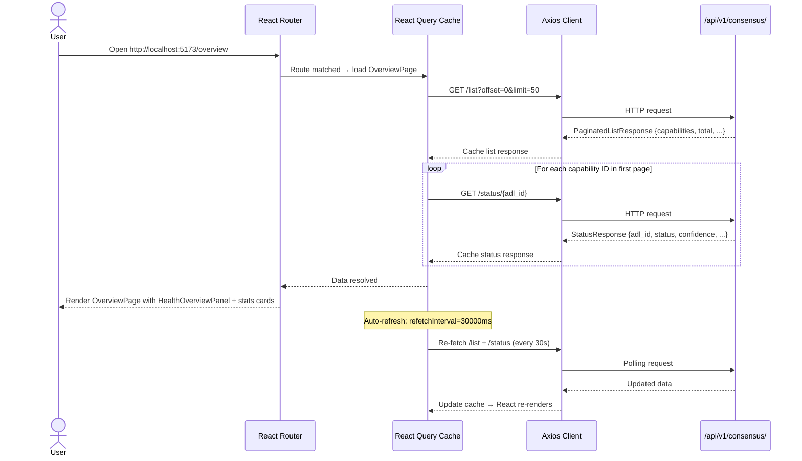
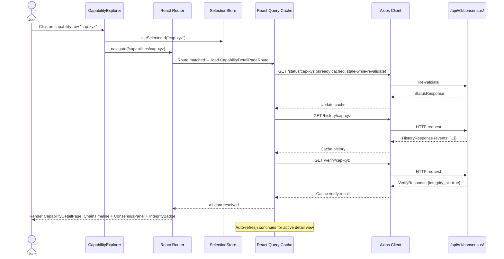
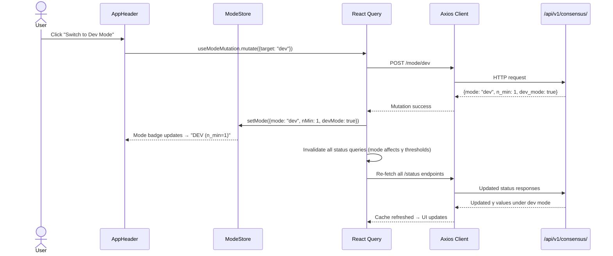
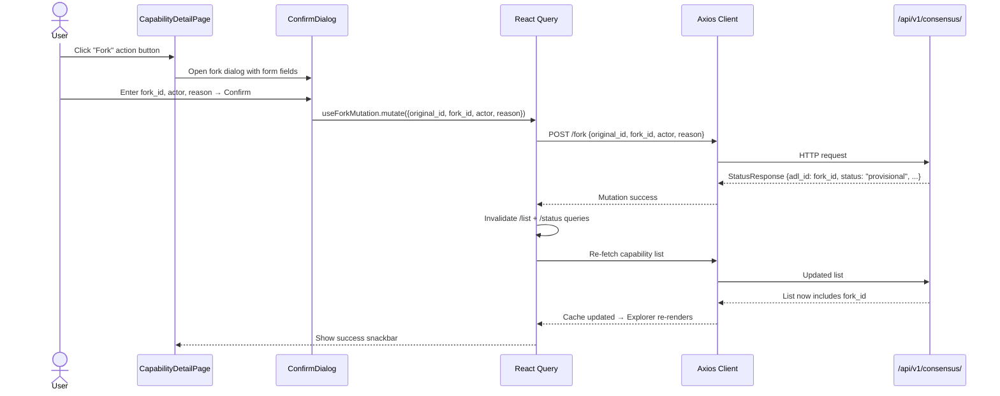
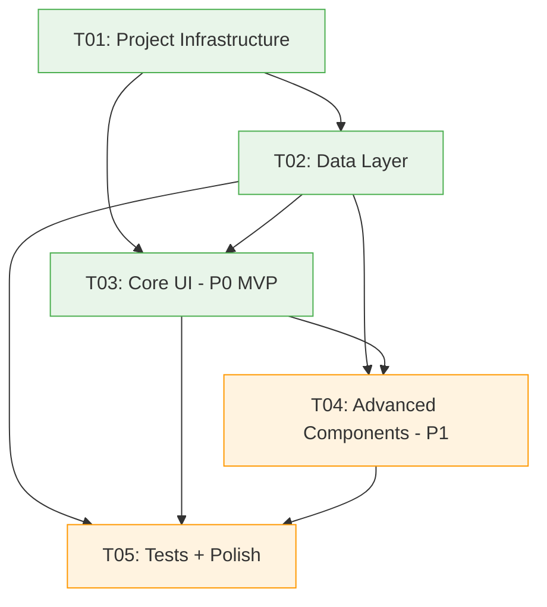

# ADL Lite Dashboard — System Architecture & Task Decomposition

> **Author**: 高见远（Gao） · Architect  
> **Date**: 2025-06-29  
> **Version**: 1.0  
> **Status**: Draft for Engineer implementation

---

## Part A: System Design

### 1. Implementation Approach

#### 1.1 Core Technical Challenges

| Challenge | Description | Resolution |
|-----------|-------------|------------|
| **Fork relationship reconstruction** | `/list` returns flat capability IDs; fork parent-child relationships are only visible inside `/history` event payloads (type=`fork`, payload contains `original_id`) | Fetch `/history` for each capability to extract fork anchors; build a client-side fork adjacency map |
| **Per-validator confidence extraction** | `/status` returns aggregate γ; individual validator votes are embedded in `/history` events (type=`validate`, payload contains per-actor confidence) | Reconstruct validator detail from event history on the client side |
| **EWMA curve computation** | No dedicated EWMA endpoint; γ_ewma must be computed from sequential `calibrate`/`validate` events | Compute EWMA client-side from `/history` events with α=0.3 (same as backend `calibration.ewma_confidence`) |
| **Auto-refresh without hammering API** | 30s polling for ~10 endpoints must stay under 60 req/min rate limit | Use React Query's `refetchInterval` with smart stale-ness; batch status checks; only poll active views |
| **SPA routing + deep-link capability detail** | Routes `/overview`, `/capabilities`, `/capabilities/:adl_id` need data preloading | React Router v6 with data loaders; prefetch capability list on mount |

#### 1.2 Framework & Library Selection

| Layer | Choice | Justification |
|-------|--------|---------------|
| **Build tool** | Vite 5 | Fast HMR, native TS support, simple config |
| **UI framework** | React 18 | Component model fits dashboard widget layout; concurrent features for smooth updates |
| **Language** | TypeScript 5 | Strict typing for API response contracts; prevents runtime shape errors |
| **Component library** | MUI v5 | Rich data-display components (DataGrid, Card, Timeline); theme system for dark/light |
| **Utility styling** | Tailwind CSS 3 | Quick layout tweaks, spacing, responsive breakpoints alongside MUI |
| **Data fetching** | @tanstack/react-query v5 | Built-in caching, refetchInterval, stale-while-revalidate; eliminates manual polling logic |
| **Routing** | react-router-dom v6 | Nested routes, data loaders, URL param extraction for `:adl_id` |
| **Charts** | Recharts v2 | Declarative line charts for γ_ewma calibration curves; lightweight vs D3 |
| **Tree visualization** | react-d3-tree v3 | Fork tree as hierarchical D3 tree; handles branching naturally |
| **State management** | React Context + Zustand | Context for theme/mode (global); Zustand for capability selection state (cross-component) |
| **HTTP client** | Axios v1 | Request/response interceptors for base URL and error normalization |

#### 1.3 Architecture Pattern

**Component-Driven SPA** (no server-side rendering):

- **Presentation Layer**: React components (MUI + Tailwind)
- **Data Layer**: React Query cache (server state) + Zustand store (client state)
- **Routing Layer**: React Router v6 with nested layouts
- **API Layer**: Axios client → REST endpoints under `/api/v1/consensus/`

No MVVM/MVC overhead — React Query acts as the "ViewModel" by managing server state lifecycle, and Zustand handles ephemeral UI state (selected capability, filters, theme toggle).

---

### 2. File List

All files reside under `dashboard/` at the project root (NOT inside `adl_lite/` Python package).

```
dashboard/
├── package.json
├── vite.config.ts
├── tsconfig.json
├── tsconfig.node.json
├── tailwind.config.ts
├── postcss.config.js
├── index.html
├── .env.example
├── public/
│   └── favicon.svg
├── src/
│   ├── main.tsx                           # App entry point
│   ├── App.tsx                            # Root component + router
│   ├── vite-env.d.ts                      # Vite type declarations
│   ├── api/
│   │   ├── client.ts                      # Axios instance + interceptors
│   │   ├── types.ts                       # API response TypeScript interfaces
│   │   ├── endpoints.ts                   # React Query hook factory (useCapabilities, useStatus, etc.)
│   │   └── mocks.ts                       # Mock data for dev/testing
│   ├── store/
│   │   ├── useThemeStore.ts               # Dark/light theme Zustand store
│   │   ├── useSelectionStore.ts           # Selected capability + filters Zustand store
│   │   └── useModeStore.ts                # Consensus mode (dev/production) Zustand store
│   ├── hooks/
│   │   ├── usePolling.ts                  # 30s auto-refresh wrapper
│   │   ├── useForkTree.ts                 # Build fork adjacency from history events
│   │   ├── useEwmaCurve.ts               # Compute EWMA series from event history
│   │   ├── useConfidenceColor.ts          # γ → color mapping (green/yellow/red)
│   │   └── useValidatorDetail.ts          # Extract per-validator votes from history
│   ├── components/
│   │   ├── layout/
│   │   │   ├── AppLayout.tsx              # Shell: sidebar + header + main content
│   │   │   ├── AppSidebar.tsx             # Navigation sidebar (Overview, Capabilities)
│   │   │   ├── AppHeader.tsx              # Top bar: mode badge + theme toggle + refresh
│   │   │   └── ResponsiveContainer.tsx    # Responsive wrapper (desktop-first, mobile stacking)
│   │   ├── overview/
│   │   │   ├── HealthOverviewPanel.tsx     # Stats cards: total, active, deprecated, avg γ, mode
│   │   │   ├── StatusCard.tsx             # Individual stat card component
│   │   │   ├── ConfidenceGauge.tsx        # Circular gauge for average γ
│   │   │   └── ModeIndicator.tsx          # Dev/Production mode badge
│   │   ├── capabilities/
│   │   │   ├── CapabilityExplorer.tsx      # Paginated list + search + status filter
│   │   │   ├── CapabilityRow.tsx          # Single row: ID, status badge, γ, validators count
│   │   │   ├── CapabilitySearchBar.tsx    # Search input + status dropdown filter
│   │   │   └── ConfidenceRangeSlider.tsx  # P1: 0-1 slider for γ range filter
│   │   ├── detail/
│   │   │   ├── CapabilityDetailPage.tsx   # Container: chain + consensus + charts
│   │   │   ├── ChainTimelineView.tsx      # Event chain as vertical timeline
│   │   │   ├── TimelineEventNode.tsx      # Single event node in timeline
│   │   │   ├── IntegrityBadge.tsx         # Chain integrity verification badge
│   │   │   ├── ConsensusDetailPanel.tsx   # Validators list, N/M ratio, γ confidence
│   │   │   ├── ValidatorVoteRow.tsx        # Per-validator vote row
│   │   │   ├── CalibrationChart.tsx       # P1: γ_ewma line chart (Recharts)
│   │   │   ├── ForkTreeView.tsx           # P1: Fork tree visualization (react-d3-tree)
│   │   │   └── CapabilityActions.tsx      # P1: Register/transition/fork action buttons + dialogs
│   │   ├── shared/
│   │   │   ├── StatusBadge.tsx            # Status emoji badge (🟡🟢🔴🔵⚪)
│   │   │   ├── ConfidenceDot.tsx          # γ color dot (green/yellow/red)
│   │   │   ├── LoadingSkeleton.tsx        # MUI skeleton placeholder
│   │   │   ├── ErrorAlert.tsx             # Error display with retry button
│   │   │   └── ConfirmDialog.tsx          # Reusable confirmation dialog (for actions)
│   │   └── theme/
│   │       └── ThemeProvider.tsx           # MUI + Tailwind dark/light theme wrapper
│   │       └── theme.ts                   # MUI theme tokens (colors, typography)
│   ├── pages/
│   │   ├── OverviewPage.tsx               # /overview route page
│   │   ├── CapabilitiesPage.tsx           # /capabilities route page
│   │   └── CapabilityDetailPageRoute.tsx  # /capabilities/:adl_id route page
│   ├── router/
│   │   └── index.tsx                      # Route definitions + data loaders
│   ├── utils/
│   │   ├── constants.ts                   # Polling interval, color thresholds, API base URL
│   │   ├── ewma.ts                        # EWMA computation function (pure, testable)
│   │   ├── forkGraph.ts                   # Fork adjacency builder from event payloads
│   │   ├── formatters.ts                  # Date/time, confidence percentage formatting
│   │   └── confidenceColor.ts             # γ → MUI color mapping utility
│   └── styles/
│       ├── globals.css                    # Tailwind directives + global resets
│       └── overrides.css                  # MUI + Tailwind coexistence overrides
├── dashboard/tests/                       # Test files (mirror src structure)
│   ├── utils/
│   │   ├── ewma.test.ts
│   │   ├── forkGraph.test.ts
│   │   ├── confidenceColor.test.ts
│   │   └── formatters.test.ts
│   ├── hooks/
│   │   ├── useForkTree.test.ts
│   │   ├── useEwmaCurve.test.ts
│   │   └── useConfidenceColor.test.ts
│   └── components/
│   │   ├── overview/
│   │   │   └── HealthOverviewPanel.test.tsx
│   │   ├── capabilities/
│   │   │   └── CapabilityExplorer.test.tsx
│   │   └── detail/
│   │   │   ├── ChainTimelineView.test.tsx
│   │   │   └── ConsensusDetailPanel.test.tsx
│   │   └── shared/
│   │   │   ├── StatusBadge.test.tsx
│   │   │   └── ConfirmDialog.test.tsx
```

---

### 3. Data Structures and Interfaces

```mermaid
classDiagram
    direction TB

    %% ===== API Response Types =====
    class StatusResponse {
        +string adl_id
        +string status
        +float confidence
        +string[] validators
        +boolean dev_mode
    }

    class HistoryResponse {
        +string adl_id
        +EventDict[] events
    }

    class EventDict {
        +string event_id
        +string concept_id
        +string event_type
        +string actor
        +string reasoning
        +string timestamp
        +object payload
        +string previous_event_id
        +string hash
    }

    class PaginatedListResponse {
        +string[] capabilities
        +int total
        +int count
        +int offset
        +int limit
    }

    class VerifyResponse {
        +string adl_id
        +boolean integrity_ok
    }

    class ModeResponse {
        +string mode
        +int n_min
        +boolean dev_mode
    }

    class ErrorResponse {
        +string error
        +string detail
    }

    %% ===== Request Types =====
    class RegisterRequest {
        +string adl_id
        +string scope
        +string domain
    }

    class TransitionRequest {
        +string adl_id
        +string to_status
        +string actor
        +string reason
        +object payload
    }

    class ForkRequest {
        +string original_id
        +string fork_id
        +string actor
        +string reason
    }

    %% ===== Client-Side Derived Types =====
    class CapabilitySummary {
        +string adl_id
        +string status
        +float confidence
        +string[] validators
        +int validator_count
        +string confidence_color
    }

    class ForkEdge {
        +string parent_id
        +string child_id
        +string actor
        +string reason
        +string timestamp
    }

    class ForkNode {
        +string adl_id
        +string status
        +float confidence
        +ForkNode[] children
    }

    class EwmaPoint {
        +string timestamp
        +float ewma_value
        +string actor
    }

    class ValidatorVote {
        +string actor
        +float confidence
        +string timestamp
        +string reasoning
    }

    class HealthStats {
        +int total
        +int active
        +int deprecated
        +int forked
        +float avg_confidence
        +string mode
    }

    %% ===== Zustand Store Types =====
    class ThemeStore {
        +string theme "light" | "dark"
        +toggleTheme() void
    }

    class SelectionStore {
        +string selectedAdlId
        +string searchQuery
        +string statusFilter
        +number confidenceMin
        +number confidenceMax
        +setSelectedId(id) void
        +setSearchQuery(q) void
        +setStatusFilter(f) void
        +setConfidenceRange(min, max) void
    }

    class ModeStore {
        +string currentMode "dev" | "production"
        +int nMin
        +boolean devMode
        +setMode(response) void
    }

    %% ===== React Query Hook Interfaces =====
    class ApiEndpoints {
        +useCapabilities() UseQueryResult~PaginatedListResponse~
        +useStatus(adl_id) UseQueryResult~StatusResponse~
        +useHistory(adl_id) UseQueryResult~HistoryResponse~
        +useVerify(adl_id) UseQueryResult~VerifyResponse~
        +useMode() UseQueryResult~ModeResponse~
        +useRegister(req) UseMutationResult
        +useTransition(req) UseMutationResult
        +useFork(req) UseMutationResult
    }

    %% ===== Component Props =====
    class StatusCardProps {
        +string label
        +number value
        +string icon
        +string color
    }

    class CapabilityRowProps {
        +CapabilitySummary capability
        +onClick() void
    }

    class TimelineEventNodeProps {
        +EventDict event
        +boolean isLast
    }

    class ValidatorVoteRowProps {
        +ValidatorVote vote
        +string status
    }

    class ConfirmDialogProps {
        +string title
        +string description
        +onConfirm() void
        +onCancel() void
        +boolean open
    }

    %% ===== Relationships =====
    HistoryResponse --> EventDict : contains
    PaginatedListResponse --> CapabilitySummary : transformed by client
    StatusResponse --> CapabilitySummary : merged into
    HistoryResponse --> ForkEdge : extracts fork anchors
    HistoryResponse --> ValidatorVote : extracts validate events
    HistoryResponse --> EwmaPoint : computes EWMA series
    ForkEdge --> ForkNode : builds tree
    StatusResponse --> HealthStats : aggregated across all capabilities
    ApiEndpoints --> StatusResponse : fetches
    ApiEndpoints --> HistoryResponse : fetches
    ApiEndpoints --> PaginatedListResponse : fetches
    ApiEndpoints --> VerifyResponse : fetches
    ApiEndpoints --> ModeResponse : fetches
```



---

### 4. Program Call Flow

#### 4.1 Dashboard Initial Load → Overview Page



#### 4.2 User Clicks Capability → Detail View



#### 4.3 Mode Toggle (P1)



#### 4.4 Capability Action: Fork (P1)



---

### 5. Anything UNCLEAR

| # | Item | Assumption Made | Risk |
|---|------|-----------------|------|
| UC-1 | **Fork tree depth** | Forks are single-level (no recursive fork-of-fork in MVP). P1 ForkTreeView handles 2 levels. | If recursive forks exist, tree visualization needs pruning/virtualization |
| UC-2 | **Capability metadata** | `/list` returns only `string[]` of IDs; no domain, scope, or description. Summary cards derived from `/status` only. | Richer metadata would require backend enhancement (not in scope) |
| UC-3 | **Event payload shape** | Assuming `payload` dict in validate events contains `confidence` and `reasoning`; fork events contain `original_id`. | If payload keys differ, transformation hooks need adjustment |
| UC-4 | **Auth integration** | Design assumes `auth_enabled=False` (no headers). If auth is enabled later, Axios interceptor adds JWT/API-key header. | Minimal impact — interceptor pattern already in design |
| UC-5 | **Pagination total vs count** | API returns both `total` and `count` (backward compat). We use `total` for page count, ignore `count`. | If `total` is ever removed, fall back to `count` |
| UC-6 | **CORS** | Assuming Vite dev proxy forwards to backend. Production may need CORS headers on FastAPI. | Vite proxy handles dev; production deployment docs needed |

---

## Part B: Task Decomposition

### 6. Required Packages

#### Production Dependencies

```
- react@^18.3.1: UI framework
- react-dom@^18.3.1: React DOM renderer
- @mui/material@^5.15.0: Component library (Cards, DataGrid, Dialog, etc.)
- @mui/icons-material@^5.15.0: Icon set for status badges, actions
- @emotion/react@^11.11.0: MUI required emotion engine
- @emotion/styled@^11.11.0: MUI required emotion styled
- @tanstack/react-query@^5.50.0: Server state management (caching, polling, mutations)
- react-router-dom@^6.23.0: SPA routing with data loaders
- axios@^1.7.0: HTTP client with interceptors
- recharts@^2.12.0: Declarative chart library (line charts for EWMA)
- react-d3-tree@^3.4.0: Hierarchical tree visualization (fork graph)
- zustand@^4.5.0: Lightweight client state store
- @mui/x-data-grid@^7.10.0: Advanced data grid for capability list (pagination, sorting, filtering)
```

#### Development Dependencies

```
- vite@^5.3.0: Build tool + dev server
- @vitejs/plugin-react@^4.3.0: Vite React plugin (JSX transform, HMR)
- typescript@^5.4.0: TypeScript compiler
- @types/react@^18.3.0: React type definitions
- @types/react-dom@^18.3.0: React DOM type definitions
- tailwindcss@^3.4.0: Utility CSS framework
- postcss@^8.4.0: CSS processing (Tailwind required)
- autoprefixer@^10.4.0: CSS autoprefixer (Tailwind required)
- @typescript-eslint/eslint-plugin@^7.0.0: TS linting rules
- @typescript-eslint/parser@^7.0.0: TS ESLint parser
- eslint@^8.57.0: Linter core
- eslint-plugin-react-hooks@^4.6.0: React hooks lint rules
- vitest@^1.6.0: Unit test runner (Vite-native)
- @testing-library/react@^16.0.0: React component testing
- @testing-library/jest-dom@^6.4.0: DOM assertion extensions
- jsdom@^24.0.0: DOM environment for tests
```

---

### 7. Task List (ordered by dependency)

#### T01: Project Infrastructure — Config + Entry + Dependencies

| Field | Value |
|-------|-------|
| **Priority** | P0 |
| **Dependencies** | None |
| **Source Files** | `dashboard/package.json`, `dashboard/vite.config.ts`, `dashboard/tsconfig.json`, `dashboard/tsconfig.node.json`, `dashboard/tailwind.config.ts`, `dashboard/postcss.config.js`, `dashboard/index.html`, `dashboard/.env.example`, `dashboard/public/favicon.svg`, `dashboard/src/main.tsx`, `dashboard/src/App.tsx`, `dashboard/src/vite-env.d.ts`, `dashboard/src/styles/globals.css`, `dashboard/src/styles/overrides.css` |
| **Description** | Scaffold the Vite + React + TS + MUI + Tailwind project. Install all deps. Configure Vite dev proxy to `/api/v1/consensus/` on localhost:8000. Set up Tailwind + MUI coexistence (emotion + tailwindcss). Create `main.tsx` entry point with QueryClientProvider + ThemeProvider wrapper. Create `App.tsx` shell with Outlet placeholder. Create `globals.css` with Tailwind directives. Create `.env.example` with `VITE_API_BASE_URL=http://localhost:8000`. |

#### T02: Data Layer — API Client + Types + React Query Hooks + Stores

| Field | Value |
|-------|-------|
| **Priority** | P0 |
| **Dependencies** | T01 |
| **Source Files** | `dashboard/src/api/client.ts`, `dashboard/src/api/types.ts`, `dashboard/src/api/endpoints.ts`, `dashboard/src/api/mocks.ts`, `dashboard/src/store/useThemeStore.ts`, `dashboard/src/store/useSelectionStore.ts`, `dashboard/src/store/useModeStore.ts`, `dashboard/src/utils/constants.ts`, `dashboard/src/utils/ewma.ts`, `dashboard/src/utils/forkGraph.ts`, `dashboard/src/utils/formatters.ts`, `dashboard/src/utils/confidenceColor.ts`, `dashboard/src/hooks/usePolling.ts`, `dashboard/src/hooks/useForkTree.ts`, `dashboard/src/hooks/useEwmaCurve.ts`, `dashboard/src/hooks/useConfidenceColor.ts`, `dashboard/src/hooks/useValidatorDetail.ts`, `dashboard/tests/utils/ewma.test.ts`, `dashboard/tests/utils/forkGraph.test.ts`, `dashboard/tests/utils/confidenceColor.test.ts`, `dashboard/tests/utils/formatters.test.ts` |
| **Description** | Build the data infrastructure. (1) Axios client with base URL from env, error interceptor → normalized ErrorResponse. (2) TypeScript interfaces mirroring all API response types (StatusResponse, HistoryResponse, PaginatedListResponse, VerifyResponse, ModeResponse, EventDict) + derived types (CapabilitySummary, ForkEdge, EwmaPoint, ValidatorVote, HealthStats). (3) React Query hooks: `useCapabilities`, `useStatus`, `useHistory`, `useVerify`, `useMode`, `useRegister`, `useTransition`, `useFork` — all with 30s refetchInterval for GET queries, invalidation on mutation success. (4) Zustand stores: theme (light/dark), selection (selectedAdlId, searchQuery, statusFilter, confidenceRange), mode (currentMode, nMin, devMode). (5) Pure utility functions: ewma computation, fork graph builder, confidence color mapper, date/confidence formatters. (6) Mock data for dev/testing. Include unit tests for all pure utils. |

#### T03: Core UI — Layout + Overview + Capability Explorer + Detail Views (P0 MVP)

| Field | Value |
|-------|-------|
| **Priority** | P0 |
| **Dependencies** | T01, T02 |
| **Source Files** | `dashboard/src/components/layout/AppLayout.tsx`, `dashboard/src/components/layout/AppSidebar.tsx`, `dashboard/src/components/layout/AppHeader.tsx`, `dashboard/src/components/layout/ResponsiveContainer.tsx`, `dashboard/src/components/overview/HealthOverviewPanel.tsx`, `dashboard/src/components/overview/StatusCard.tsx`, `dashboard/src/components/overview/ConfidenceGauge.tsx`, `dashboard/src/components/overview/ModeIndicator.tsx`, `dashboard/src/components/capabilities/CapabilityExplorer.tsx`, `dashboard/src/components/capabilities/CapabilityRow.tsx`, `dashboard/src/components/capabilities/CapabilitySearchBar.tsx`, `dashboard/src/components/detail/CapabilityDetailPage.tsx`, `dashboard/src/components/detail/ChainTimelineView.tsx`, `dashboard/src/components/detail/TimelineEventNode.tsx`, `dashboard/src/components/detail/IntegrityBadge.tsx`, `dashboard/src/components/detail/ConsensusDetailPanel.tsx`, `dashboard/src/components/detail/ValidatorVoteRow.tsx`, `dashboard/src/components/shared/StatusBadge.tsx`, `dashboard/src/components/shared/ConfidenceDot.tsx`, `dashboard/src/components/shared/LoadingSkeleton.tsx`, `dashboard/src/components/shared/ErrorAlert.tsx`, `dashboard/src/components/theme/ThemeProvider.tsx`, `dashboard/src/components/theme/theme.ts`, `dashboard/src/pages/OverviewPage.tsx`, `dashboard/src/pages/CapabilitiesPage.tsx`, `dashboard/src/pages/CapabilityDetailPageRoute.tsx`, `dashboard/src/router/index.tsx` |
| **Description** | Build all P0 UI components and wire them together. (1) Layout shell: AppLayout (MUI Box + sidebar + content area), AppSidebar (nav links), AppHeader (mode badge + refresh indicator), ResponsiveContainer (desktop-first stacking). (2) Theme: ThemeProvider wrapping MUI CssBaseline + dark/light toggle, theme.ts defining palette tokens. (3) Overview: HealthOverviewPanel aggregates `/list` + all `/status` → HealthStats; StatusCard for each metric; ConfidenceGauge (circular); ModeIndicator badge. (4) Capability Explorer: CapabilityExplorer uses MUI X DataGrid with pagination; CapabilityRow; CapabilitySearchBar with status dropdown filter. (5) Detail: CapabilityDetailPage with chain timeline + consensus panel; ChainTimelineView (vertical MUI Timeline); TimelineEventNode; IntegrityBadge from `/verify`; ConsensusDetailPanel with validator list + N/M ratio + γ; ValidatorVoteRow. (6) Shared: StatusBadge (emoji), ConfidenceDot, LoadingSkeleton, ErrorAlert. (7) Router: React Router v6 with nested routes (/overview, /capabilities, /capabilities/:adl_id). |

#### T04: Advanced Components — Charts + Fork Tree + Actions + Filters (P1)

| Field | Value |
|-------|-------|
| **Priority** | P1 |
| **Dependencies** | T01, T02, T03 |
| **Source Files** | `dashboard/src/components/detail/CalibrationChart.tsx`, `dashboard/src/components/detail/ForkTreeView.tsx`, `dashboard/src/components/detail/CapabilityActions.tsx`, `dashboard/src/components/capabilities/ConfidenceRangeSlider.tsx`, `dashboard/src/components/shared/ConfirmDialog.tsx` |
| **Description** | Build P1 features on top of the P0 MVP. (1) CalibrationChart: Recharts LineChart rendering EWMA curve from `useEwmaCurve` hook output; axes: timestamp (X) vs γ_ewma (Y); color gradient green→yellow→red. (2) ForkTreeView: react-d3-tree rendering fork hierarchy from `useForkTree` output; nodes show adl_id + status badge + γ; collapsible branches. (3) CapabilityActions: MUI ButtonGroup (Register, Transition, Fork) → each opens ConfirmDialog with appropriate form fields; uses `useRegister`, `useTransition`, `useFork` mutations; success → invalidate queries + snackbar. (4) ConfidenceRangeSlider: MUI Slider (0-1 range) for γ filter; updates SelectionStore.confidenceRange → re-filters capability list. (5) ConfirmDialog: reusable MUI Dialog with title, description, confirm/cancel buttons. |

#### T05: Tests + Polish — Component Tests + Integration Checks + Final Debugging

| Field | Value |
|-------|-------|
| **Priority** | P1 |
| **Dependencies** | T02, T03, T04 |
| **Source Files** | `dashboard/tests/hooks/useForkTree.test.ts`, `dashboard/tests/hooks/useEwmaCurve.test.ts`, `dashboard/tests/hooks/useConfidenceColor.test.ts`, `dashboard/tests/components/overview/HealthOverviewPanel.test.tsx`, `dashboard/tests/components/capabilities/CapabilityExplorer.test.tsx`, `dashboard/tests/components/detail/ChainTimelineView.test.tsx`, `dashboard/tests/components/detail/ConsensusDetailPanel.test.tsx`, `dashboard/tests/components/shared/StatusBadge.test.tsx`, `dashboard/tests/components/shared/ConfirmDialog.test.tsx` |
| **Description** | Write component-level tests using Vitest + React Testing Library. (1) HealthOverviewPanel: verify stats cards render with mock data, auto-refresh triggers. (2) CapabilityExplorer: verify search, status filter, pagination, row click → navigation. (3) ChainTimelineView: verify event nodes render, integrity badge shows. (4) ConsensusDetailPanel: validator votes, N/M ratio, confidence display. (5) Shared components: StatusBadge maps status→emoji correctly, ConfirmDialog opens/closes. (6) Hook tests: useForkTree builds correct adjacency, useEwmaCurve computes expected series, useConfidenceColor returns correct palette. Run full test suite; fix any integration issues between router, queries, and components. |

---

### 8. Shared Knowledge

Cross-file conventions the Engineer must follow:

```
- API Base URL: Read from VITE_API_BASE_URL env var (default: http://localhost:8000/api/v1/consensus)
- All API error responses: Normalize to ErrorResponse {error, detail} via Axios interceptor
- Confidence color thresholds:
    γ ≥ 0.8  → green  (#4caf50 / MUI success)
    γ ≥ 0.5  → yellow (#ff9800 / MUI warning)
    γ < 0.5  → red    (#f44336 / MUI error)
- Polling interval: 30 seconds (refetchInterval: 30000 in React Query)
- EWMA alpha: 0.3 (matching backend calibration.ewma_confidence default)
- Status badges: provisional=🟡, validated=🟢, deprecated=🔴, forked=🔵, archived=⚪
- Component naming: PascalCase for components, camelCase for hooks/utils
- Import organization order: (1) React/MUI, (2) third-party, (3) internal api/store/hooks, (4) internal components, (5) types
- File organization: One component per file; test file mirrors src path under tests/
- MUI + Tailwind coexistence: MUI for interactive components (Dialog, DataGrid, Slider); Tailwind for layout/spacing/responsive utilities only
- React Query key structure: ['capabilities', {offset, limit}] for list; ['status', adl_id] for status; ['history', adl_id] for history
- Mutation invalidation: On success, invalidate related query keys (e.g., fork → invalidate ['capabilities', 'status', original_id])
- Vite proxy config: proxy /api/v1 → http://localhost:8000 (dev only; production uses env base URL)
- Dark/Light theme: MUI ThemeProvider + CssBaseline; Tailwind dark mode via class strategy (adds 'dark' to document root)
- Date formatting: ISO 8601 input → display as "YYYY-MM-DD HH:mm" via formatters.ts
- Responsive breakpoints: Desktop-first; MUI Grid system; below 768px → stack layout (sidebar collapses to hamburger)
```

---

### 9. Task Dependency Graph



Legend: Green = P0 (MVP), Orange = P1 (Enhancement)

---

### 10. Open Items for Engineer

| # | Item | Recommendation |
|---|------|---------------|
| OI-1 | **MUI X DataGrid vs custom table** | Start with MUI X DataGrid (community version, free) for paginated list. If bundle size is concern, swap to MUI Table + custom pagination. |
| OI-2 | **react-d3-tree bundle size** | react-d3-tree pulls in D3 (~80KB). If bundle size matters, consider a simpler TreeView from MUI for P1, upgrade to D3 for richer fork viz. |
| OI-3 | **Vite proxy vs CORS** | Dev uses Vite proxy. For production, ensure FastAPI serves CORS headers (via `fastapi.middleware.CORSMiddleware`). Document this in deployment notes. |
| OI-4 | **Mock data strategy** | Create `mocks.ts` with realistic sample data (5 capabilities, 10-20 events each) for dev without backend. Consider MSW (Mock Service Worker) for more realistic API mocking in tests. |
| OI-5 | **Error boundary** | Add a React ErrorBoundary at the AppLayout level to catch render errors gracefully. Not in the file list but recommended during T03 implementation. |
| OI-6 | **Accessibility** | MUI components have built-in ARIA. Ensure custom timeline nodes and tree nodes also have appropriate aria-labels. Test with keyboard navigation. |
| OI-7 | **Bundle optimization** | Use Vite's `build.rollupOptions.output.manualChunks` to split MUI, Recharts, and D3 into separate chunks for better caching. |
