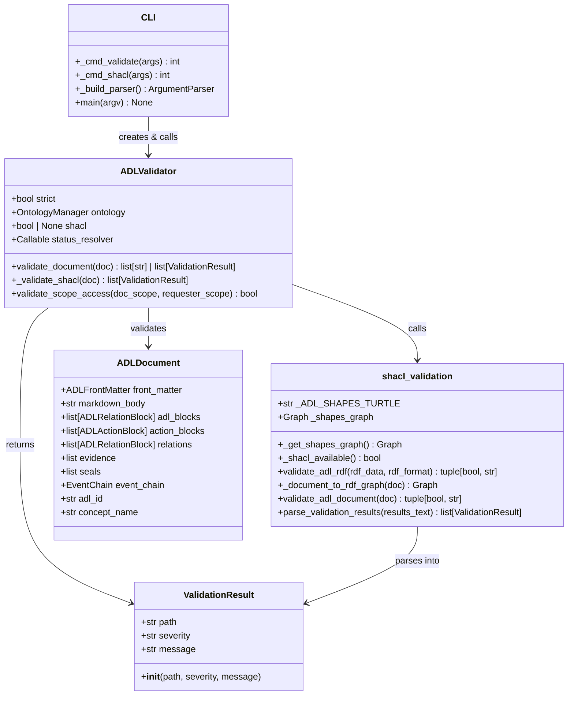
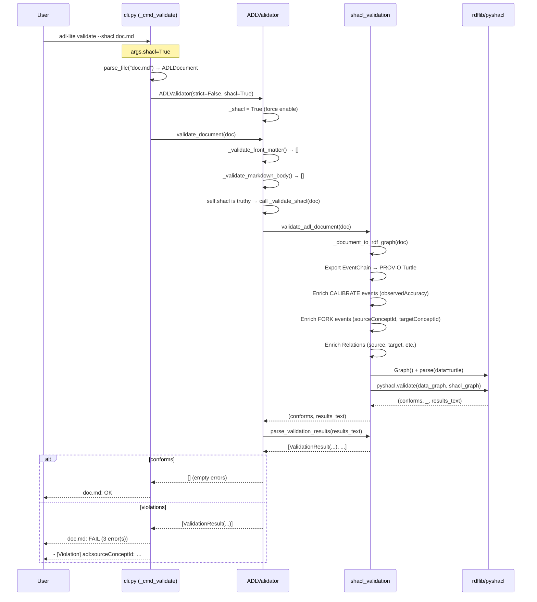
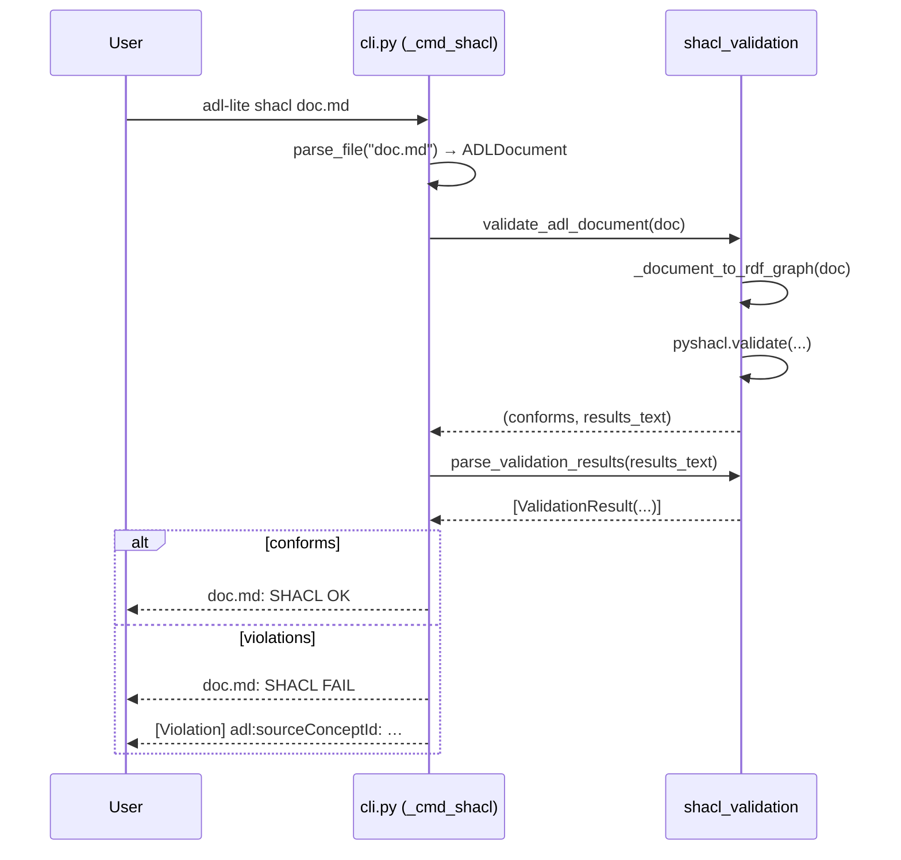
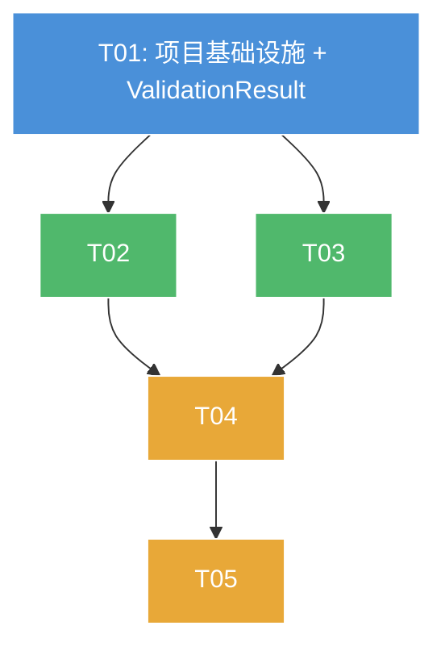

# ADL Lite — SHACL Runtime Complete Version: System Design & Task Decomposition

> **Architect**: 高见远 (Bob)  
> **Version**: F28 SHACL Runtime Complete  
> **Base**: ADL Lite v0.6.0-alpha  

---

## Part A: System Design

### 1. Implementation Approach

#### Core Technical Challenges

| Challenge | Analysis |
|-----------|----------|
| **FORK payload enrichment** | FORK events carry `source_concept_id` / `target_concept_id` inside the JSON payload literal (`adl:payload`). SHACL cannot inspect JSON literals; these must be extracted into named RDF properties (`adl:sourceConceptId`, `adl:targetConceptId`) in `_document_to_rdf_graph()`, following the same pattern used for CALIBRATE's `observedAccuracy`. |
| **ValidationResult structure** | Currently `_validate_shacl()` returns `list[str]` (human-readable text). P0-5 requires a structured `ValidationResult` dataclass with `path`, `severity`, `message`. The pyshacl report text must be parsed into these fields. |
| **Default-on auto-detect** | `ADLValidator(shacl=False)` must become `ADLValidator(shacl=None)` where `None` means "enabled if pyshacl importable". This requires a try/import check that mirrors existing `_shacl_available()` in `shacl_validation.py`. |
| **CLI flags** | `--shacl` (enable), `--no-shacl` (force-disable when auto-detect would enable), and a standalone `adl-lite shacl <files>` subcommand. All three must compose correctly. |

#### Framework & Library Selections

| Library | Version | Justification |
|---------|---------|---------------|
| `pyshacl` | >=0.25 | Already used; provides the SHACL validation engine. No upgrade needed. |
| `rdflib` | >=7.0 | Already used; provides RDF graph handling. No upgrade needed. |

**No new dependencies required.** Both `pyshacl` and `rdflib` are already declared in `[project.optional-dependencies] gov`.

#### Architecture Pattern

```
CLI (argparse) ──→ ADLValidator ──→ shacl_validation ──→ pyshacl
   │                    │                                      │
   │  --shacl/--no-shacl│  ValidationResult[]                  │
   │  shacl subcommand  │                                      │
   ▼                    ▼                                      ▼
args               validate_document()                   validate() RDF
```

Pattern: **Layered validation** — SSA checks happen first (pronoun/scope/slot), SHACL structural checks happen second. The Validator acts as the orchestrator; `shacl_validation.py` is the SHACL engine that knows RDF.

---

### 2. File List

All relative paths are from project root.

| # | File | Action | Purpose |
|---|------|--------|---------|
| 1 | `adl_lite/models.py` | **Modify** | Add `ValidationResult` dataclass |
| 2 | `adl_lite/__init__.py` | **Modify** | Export `ValidationResult` |
| 3 | `adl_lite/validator.py` | **Modify** | `shacl=None` default; `_validate_shacl()` returns `list[ValidationResult]` |
| 4 | `adl_lite/shacl_validation.py` | **Modify** | Add `ForkShape` Turtle; enrich FORK events in `_document_to_rdf_graph()`; add `parse_validation_results()` helper |
| 5 | `adl_lite/cli.py` | **Modify** | `--shacl`/`--no-shacl` flags on `validate`; new `shacl` subcommand |
| 6 | `tests/test_shacl_validation.py` | **Modify** | ForkShape tests; ValidationResult tests; default-on tests |
| 7 | `docs/class-diagram.mermaid` | **Create** | Class/data-structure diagram |
| 8 | `docs/sequence-diagram.mermaid` | **Create** | Call-flow sequence diagram |

---

### 3. Data Structures & Interfaces

#### 3a. ValidationResult Dataclass

```python
@dataclass
class ValidationResult:
    """Structured SHACL validation result."""
    path: str       # RDF property path (e.g. "adl:sourceConceptId")
    severity: str   # "Violation" | "Warning" | "Info"
    message: str    # Human-readable description
```

**Design decisions:**
- `severity` is `str`, not an enum — aligns directly with pyshacl output text, simpler for serialization, and avoids enum import chains.
- `path` is the RDF property path from the SHACL validation report (e.g. `adl:eventHash`, `adl:observedAccuracy`).
- `message` is a human-readable sentence extracted from the pyshacl report.

#### 3b. ForkShape (Turtle — SHACL Shape)

```turtle
adl:ForkShape a sh:NodeShape ;
    sh:targetClass adl:ForkEvent ;
    sh:property [
        sh:path adl:sourceConceptId ;
        sh:datatype xsd:string ;
        sh:minCount 1 ;
        sh:maxCount 1 ;
    ] ;
    sh:property [
        sh:path adl:targetConceptId ;
        sh:datatype xsd:string ;
        sh:minCount 1 ;
        sh:maxCount 1 ;
    ] .
```

This enforces that every FORK event **must** carry both a `sourceConceptId` and a `targetConceptId` as named RDF properties.

#### 3c. ADLValidator Signature Changes

```python
# BEFORE
def __init__(self, strict=False, ontology=None, shacl=False, status_resolver=None) -> None

# AFTER
def __init__(self, strict=False, ontology=None, shacl=None, status_resolver=None) -> None
    # shacl=None → auto-detect (enabled if pyshacl importable)
    # shacl=True  → force enable  (raises ImportError if pyshacl not installed)
    # shacl=False → force disable
```

```python
# BEFORE
def _validate_shacl(self, doc: ADLDocument) -> list[str]: ...

# AFTER
def _validate_shacl(self, doc: ADLDocument) -> list[ValidationResult]: ...
```

#### 3d. CLI Signature Changes

```python
# adl-lite validate --shacl [--no-shacl] <files...>
p_validate.add_argument("--shacl", action="store_true", help="Enable SHACL validation")
p_validate.add_argument("--no-shacl", action="store_true", help="Disable SHACL validation")

# adl-lite shacl [--strict] <files...>
p_shacl = sub.add_parser("shacl", help="Run SHACL validation only")
p_shacl.add_argument("files", nargs="+", help="Paths to .md documents")
```

#### 3e. `parse_validation_results()` Helper

```python
def parse_validation_results(results_text: str) -> list[ValidationResult]:
    """Parse pyshacl report text into structured ValidationResult list."""
    ...
```

Located in `shacl_validation.py`.

#### 3f. Class Diagram



---

### 4. Program Call Flow

#### Flow 1: `adl-lite validate --shacl doc.md`



#### Flow 2: `adl-lite shacl doc.md` (standalone)



---

### 5. Anything UNCLEAR

| Item | Status |
|------|--------|
| FORK payload field names | **Confirmed by PM**: `source_concept_id` / `target_concept_id` kept as-is |
| TRANSITION constraints scope | **Confirmed by PM**: SHACL handles structural; ontology layer handles state machine |
| ValidationResult.severity type | **Confirmed by PM**: `str` ("Violation"/"Warning"/"Info") — no enum |
| `--no-shacl` flag | **Confirmed by PM**: added alongside `--shacl` |
| Auto-detect behavior | Assumed: when `shacl=None`, check `pyshacl` importability; when `shacl=True`, raise `ImportError` if not importable |
| `_validate_shacl` return type change | **Breaking change**: callers expecting `list[str]` must now handle `list[ValidationResult]`. The CLI `_cmd_validate()` currently prints errors as strings. Since `ADLValidator.validate_document()` returns `list[str]` (the union of all checks), the SHACL errors must remain `str` compatible OR the whole method return type changes. **Decision**: Keep `validate_document()` returning `list[str]`, but make `_validate_shacl()` internally produce `list[ValidationResult]` and convert to `str` only for the outer return. Alternatively, add a `detailed` flag. |
| Error display format | Assumed: CLI prints `[severity] path: message` for each `ValidationResult` when `--shacl` is active |

---

## Part B: Task Decomposition

### 6. Required Packages

No new packages required. Existing dependencies for `[gov]` extra:

```
- pyshacl>=0.25       # SHACL validation engine (already in [gov] extra)
- rdflib>=7.0         # RDF graph library (already in [gov] extra)
```

Install command: `pip install -e '.[gov]'`

---

### 7. Task List (ordered by dependency)

#### T01: 项目基础设施 + ValidationResult 数据模型

| Field | Value |
|-------|-------|
| **Task ID** | T01 |
| **Priority** | P0 |
| **Name** | Project infrastructure + ValidationResult dataclass |
| **Source Files** | `adl_lite/models.py`, `adl_lite/__init__.py`, `pyproject.toml` |
| **Dependencies** | None |

**Scope:**
1. Add `ValidationResult` dataclass to `adl_lite/models.py`:
   - `path: str` — RDF property path
   - `severity: str` — "Violation" / "Warning" / "Info"
   - `message: str` — human-readable description
   - Optional `focus_node: str = ""` for the RDF node that triggered the violation
2. Export `ValidationResult` in `adl_lite/__init__.py` (both import and `__all__`)
3. `pyproject.toml`: no changes needed (dependencies already declared); verify version is `0.6.0-alpha`

---

#### T02: ADLValidator shacl 默认启用 + 结构化结果返回

| Field | Value |
|-------|-------|
| **Task ID** | T02 |
| **Priority** | P0 |
| **Name** | ADLValidator shacl default-on + structured _validate_shacl |
| **Source Files** | `adl_lite/validator.py`, `adl_lite/shacl_validation.py`, `tests/test_shacl_validation.py` |
| **Dependencies** | T01 |

**Scope:**
1. **`adl_lite/validator.py`**:
   - Change `ADLValidator.__init__` signature: `shacl: bool = False` → `shacl: bool | None = None`
   - Add `_shacl_available()` check in validator (mirror existing one in `shacl_validation.py`)
   - Update `validate_document()`: when `self.shacl is None`, auto-detect; when `True`, require pyshacl
   - Change `_validate_shacl()` return type from `list[str]` to `list[ValidationResult]`
   - Internally call `parse_validation_results()` to parse pyshacl report
   - Convert `ValidationResult` list to `str` list in `validate_document()` for backward compatibility (or introduce a `detailed` flag — **decision: keep `validate_document()` returning `list[str]`**, convert VR → str via `f"[{r.severity}] {r.path}: {r.message}"`)
2. **`adl_lite/shacl_validation.py`**:
   - Add `parse_validation_results(results_text: str) -> list[ValidationResult]` function
   - Parse pyshacl report text by splitting on blank lines, extracting `severity`, `path`, `message` using regex
3. **`tests/test_shacl_validation.py`**:
   - Add test for `parse_validation_results()` with known pyshacl output
   - Update existing tests if needed (they use the old tuple return)

---

#### T03: ForkShape SHACL 形状 + _document_to_rdf_graph Fork 富化

| Field | Value |
|-------|-------|
| **Task ID** | T03 |
| **Priority** | P0 |
| **Name** | ForkShape SHACL shape + FORK event RDF enrichment |
| **Source Files** | `adl_lite/shacl_validation.py`, `tests/test_shacl_validation.py`, `adl_lite/models.py` |
| **Dependencies** | T01 |

**Scope:**
1. **`adl_lite/shacl_validation.py`**:
   - Add ForkShape to `_ADL_SHAPES_TURTLE` (see §3b above)
   - Enrich `_document_to_rdf_graph()` — add FORK event handling:
     ```python
     if event.event_type == EventType.FORK:
         evt_uri = adl[f"evt-{doc.adl_id}-{event.event_type.value}-{idx:03d}"]
         src = event.payload.get("source_concept_id")
         tgt = event.payload.get("target_concept_id")
         if src is not None:
             g.add((evt_uri, adl.sourceConceptId, Literal(str(src))))
         if tgt is not None:
             g.add((evt_uri, adl.targetConceptId, Literal(str(tgt))))
     ```
   - Add ADL namespace terms: `adl.sourceConceptId`, `adl.targetConceptId` (already Namespace-based, auto-resolved)
2. **`tests/test_shacl_validation.py`**:
   - `test_fork_event_missing_source_fails` — FORK event without `source_concept_id` → SHACL failure
   - `test_fork_event_missing_target_fails` — FORK event without `target_concept_id` → SHACL failure
   - `test_fork_event_valid_passes` — FORK event with both fields → SHACL pass
3. **`adl_lite/models.py`** (if needed for test helpers): no changes needed, EventType.FORK already exists

---

#### T04: CLI --shacl/--no-shacl + shacl 子命令

| Field | Value |
|-------|-------|
| **Task ID** | T04 |
| **Priority** | P0 |
| **Name** | CLI --shacl/--no-shacl flags + standalone shacl subcommand |
| **Source Files** | `adl_lite/cli.py`, `tests/test_shacl_validation.py`, `tests/test_cli.py` |
| **Dependencies** | T02, T03 |

**Scope:**
1. **`adl_lite/cli.py`**:
   - **`validate` subcommand**: Add `--shacl` and `--no-shacl` flags:
     ```python
     p_validate.add_argument("--shacl", action="store_true", help="Enable SHACL validation")
     p_validate.add_argument("--no-shacl", action="store_true", help="Disable SHACL validation")
     ```
   - **`_cmd_validate()`**: Pass shacl parameter:
     ```python
     shacl = True if args.shacl else (False if args.no_shacl else None)
     validator = ADLValidator(strict=args.strict, shacl=shacl)
     ```
   - **`shacl` subcommand**: New standalone subcommand:
     ```python
     p_shacl = sub.add_parser("shacl", help="Run SHACL validation only")
     p_shacl.add_argument("files", nargs="+", help="Paths to .md documents")
     p_shacl.add_argument("--strict", action="store_true", help="Reject unknown relation predicates")
     p_shacl.set_defaults(func=_cmd_shacl)
     ```
   - **`_cmd_shacl()`**: Implementation that:
     - Creates `ADLValidator(shacl=True)` 
     - Parses each file
     - Calls `validate_adl_document()` directly (bypassing SSA checks)
     - Parses results with `parse_validation_results()`
     - Prints structured output with `[severity] path: message` format
     - Returns exit code 0 (all pass) or 1 (any fail)

2. **`tests/test_shacl_validation.py`** (integration tests):
   - `test_cli_validate_with_shacl_flag` — simulate CLI args
   - `test_cli_shacl_subcommand` — simulate `adl-lite shacl` call
   - `test_cli_no_shacl_disables` — `--no-shacl` suppresses SHACL even when pyshacl is available

3. **`tests/test_cli.py`**: If exists, add CLI-level tests; if not, create with basic argument parsing tests

---

### 8. Shared Knowledge

```
1. All ValidationResult.severity values are raw strings: "Violation", "Warning", "Info"
2. ADLValidator.shacl parameter: None=auto-detect, True=force, False=disable
3. FORK event payload dict uses "source_concept_id" and "target_concept_id" keys
4. pyshacl report text is parsed by blank-line-separated result blocks
5. validate_document() always returns list[str] for backward compatibility
6. _validate_shacl() internally returns list[ValidationResult], converted to str for outer API
7. The shacl subcommand bypasses SSA validation — it is SHACL-only
8. CLI exit codes: 0=success, 1=validation/parse failure
9. adl namespace terms added: adl:sourceConceptId, adl:targetConceptId
10. New ADL shapes all use sh:NodeShape with sh:targetClass pointing to adl:ForkEvent
```

---

### 9. Task Dependency Graph



| Task | Depends On | Parallelizable |
|------|-----------|----------------|
| **T01** Project infra | — | — |
| **T02** Validator default-on + structured results | T01 | ✅ T03 (parallel after T01) |
| **T03** ForkShape + RDF enrichment | T01 | ✅ T02 (parallel after T01) |
| **T04** CLI flags + shacl subcommand | T02, T03 | ❌ Serial |
